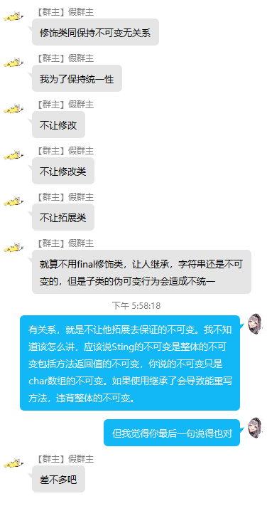
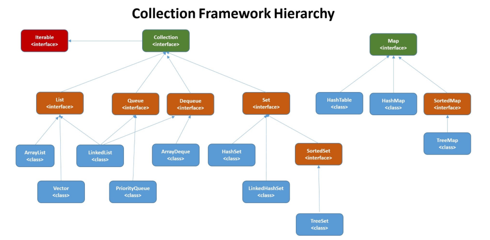

# Java基础

## Java基本数据类型：

基本类型保存原始值，引用类型保存指向对象在堆中的地址。

> byte1字节，short2字节，int4字节，long8字节
>
>  boolean1字节（争议），char2字节（char使用Unicode编码，可储存汉字）
>
> float4字节，double8字节

自动装箱：int -> Integer，自动拆箱：Integer -> int （原理：编译器支持，编译后的字节码显示自动为其执行Integer.valueOf方法和getValue方法）

**注意：Integer的valueOf方法对于-128到127之间的数会进行缓存，下次需要的时候直接去缓存取，也就是说取的是同一个Integer对象。而new Integer（123）会新创建一个新的Integer对象。**

## 面向对象三大特征：

>  封装：把数据和操作数据的方法绑定起来，对数据的访问只提供特定的接口，在外部看来，就是一个完全自治，封闭的对象。
>
> 继承：从一个已有的类得到继承信息并创建一个新类的过程。
>
> 多态：允许不同的子类型的对象调用同一方法做出不同响应。

Java创建对象的方式：new，反射Class.newInstance，clone，反序列化。

## String

Java8使用char数组储存，Java9之后使用byte数组储存再使用coder来表示使用了哪种编码。

##### String不可变：

> 1.可以缓存字符串的hash值
>
> 2.不可变能和String常量池进行一些配合，去提升一些效率。如果一个String对象在常量池中已经存在，那么直接从常量池获取引用就行了。
>
> 3.安全。String经常作为参数，不可变的话可以保证参数不可变。不可变天生线程安全。

String通过自身api实现不改变自身的private final char[] 实现不可变，还使用final修饰类，使之不能被继承来实现不可变。（继承能重写String方法，虽然无法修改private final char[] 数组，但是能返回一个子类成员变量，达到可变目的）



StringBuilder可变，线程不安全。StringBuffer可变，线程安全，内部使用synchronized同步。

##### 字符串常量池：

字符串常量池保存所有字符串字面量，这些字面量在编译时期就确定了，而且运行过程的字符串还能通过该对象的intern方法将其字面量添加到常量池中，并且返回常量池中的引用。Java7之前，字符串常量池放在永久代，Java7将其转移到堆中，因为永久代空间有限，在大量使用字符串的场景会导致oom。

## 抽象类

类和方法都需要使用abstract关键字进行声明，抽象类不能被实例化。

## 接口

字段+方法都是public的

接口字段默认static+final

## Object

* hashCode： 

  ​	返回散列值，但散列值相同对象不一定相同。重写equals一般也会重写hashCode方法，使得两个	   	equals相等的对象的hashCode也相等。

```java
	//重写hashCode通用规则
	@Override
    public int hashCode() {
        int hash = 17;
        hash = hash * 31 + getName().hashCode();
        hash = hash * 31 + getAge();
        return hash;
    }
```

* equals

* clone：

  ​	 为protected方法，需要重写，并且实现Cloneable接口，否则会抛异常。使用super.clone调用。	  	**注意：clone为浅拷贝。**

* toString

* getClass

* finalize

* notify

* notifyAll

* wait

## final：

* 数据：

  基本类型：数值不变。

  引用类型：使引用不变，并且不能引用其他对象，但被引用对象自身可变。

* 方法：

  该方法不能被重写。

* 类：

  该类不能被继承。

## 反射

每个类都有一个Class对象，包含了类的相关信息。当编译一个类时会产生一个同名的.class文件，该文件保存着Class对象。类加载相当于Class对象的加载，类在第一次使用时才会动态加载到jvm中，可以以使用Class.forName("com.mysql.jdbc.Driver")来控制类的加载，该方法会返回一个Class对象。

Field 使用get和set操作与Field对象关联的字段；

Method 使用invoke方法调用与Method对象关联的方法；

Constructor 使用其创建新的对象；

反射是程序运行中的，涉及了动态类型的解析，jvm无法对这些代码进行优化，会降低运行效率。破坏类的封装。

## 异常

Throwable 父类

子 Error 表示jvm无法处理的错误  StackOverFlowError和OutOfMemoryError

子 Exception 1.编译期异常，需要显示throws或者try catch的，不然编译会报错。

2.运行时异常，程序运行错误。

# 集合



## 大致介绍集合框架：

父接口 Collection 

子接口 Set，List，Queue，Dequeue

父接口 Map

#### Collection

* List接口

> ArrayList：基于动态数组实现，支持随机访问。
>
> Vector：和ArrayList类似，但是他是线程安全的。方法使用synchronized修饰
>
> LinkedList：基于双向链表

* Set接口

> HashSet：基于哈希表，支持快速查找，但不支持有序性操作，而且失去了插入元素是的顺序信息。
>
> LisnkedHashSet：具有HashSet的查找效率而且内部有双向链表维护元素的插入顺序。
>
> SortedSet继承Set接口
>
> TreeSet：基于红黑树，支持有序性操作，比如查找一个范围内的元素。但查找效率不如HashSet。

* Queue接口：

> LinkedList：队列
>
> PriorityQueue：基于堆结构实现，可以用它来实现优先队列。

* Dequeue接口：

> LinkedList：双端队列
>
> ArrayDequeue：基于数组的双端队列。

#### Map

> HashMap：基于哈希表实现
>
> Hashtable：与HashMap类似，但它是线程安全的，Hashtable使用synchronized修饰方法。但不应该使用这个类，已经被淘汰。
>
> LinkedHashMap：使用双向链表和HashMap，双向链表用于维护元素插入顺序或者用来做LRU。
>
> SortedMap继承Map接口
>
> TreeMap：基于红黑树实现。

## 具体：

#### List：

* ArrayList和LinkedList的区别：

ArrayList底层使用Object数组，LinkedList使用双向链表。

ArrayList支持随机访问，LinkedList不支持。

插入删除，ArrayList插入删除元素，能直接定位到元素的位置，但插入删除需要移动数组元素。LinkedList需要一个个查找来定位，但插入删除只需要操作一下链表的指针，不需要移动元素。

ArrayList数组的默认大小default capacity为10，添加元素时使用ensureCapacityInternal方法来保证容量足够，如果不够的话通过grow方法进行数组的扩容，新建一个容量为原来1.5倍的数组，然后把原数组中的元素复制到新数组中。

* ArrayList与Vector

Vector每次扩容2倍。

可以使用Collections.synchronizedList(list)来代替Vector。或者使用CopyOnWriteArrayList，适合读多写少的场景，读操作是在原数组上进行的，但写操作是在一个复制的数组上进行的，写操作需要加锁，写操作完成之后将数组引用，使用volatile修饰的，从原数组指向新数组。

* LinkedList：

使用双向链表实现，使用Node去存储节点信息，每个LinkedList保存了头指针和尾指针。

插入删除的时候需要从链表头部或者尾部开始遍历，找到对应的元素然后执行插入或者删除操作。

#### Set

* HashSet的底层是HashMap
* add

```java
public boolean add(E e) {
	return map.put(e, PRESENT)==null;
}
```

* remove

```java
public boolean remove(Object o) {
	return map.remove(o)==PRESENT;
}
```

#### Map：

* HashMap与Hashtable的不同：

默认容量：HashMap16，Hashtable11。HashMap会将给定的初始容量扩充成2的幂，但Hashtable会直接使用给定的初始容量。

扩容：HashMap每次扩容为原来的2倍。Hashtable扩容为原来的2n+1

数组创建的时机：HashMap的Node数组是在第一次put的时候创建的，Hashtable的Entry数组是在构造函数中就创建的。

数据结构：HashMap在链表长度大于8的时候会转化为红黑树。

线程安全：Hashtable方法使用synchronized修饰，是线程安全的。

* HashMap的put流程：

1.先调用hash方法获得hash值，将对象的hashCode的前16位和后16位进行一个异或操作，是一个扰动函数。

2.若node数组为空则通过resize扩容。

3.将hash值和数组长度-1进行一个按位与，得到对应的数组下标。

4.如果对应的数组下标为null就直接新建node放进去。

5.要是该节点不为空，就判断该节点的key是否相等（key相等是通过hash值和key的equals方法共同决定的），相等就覆盖，如果不相等就判断是否为红黑树节点，是的话就找key相同的节点，如果有就覆盖，如果没有就新建一个节点。

6.如果不是红黑树节点，就去遍历链表，如果有就覆盖，如果没有就新建一个，如果链表长度大于8就将链表转化成红黑树。（树化操作，如果数组长度小于64只会扩容，不会树化）

7.插入成功后，如果size超过了最大阈值就进行扩容。

* HashMap的resize

先判断数组是否为空，为空的话就新建一个数组然后返回。

不为空的话，新建一个容量为原来2倍的数组，将原数组中的元素进行进行rehash操作，然后将节点放进新数组里面。然后1.8的rehash对于链表的操作时一个尾插，1.7是头插，1.7在并发情况下可能会出现链表成环的情况。

***

通过设置断点让线程1和线程2同时debug到transfer方法(3.3小节代码块)的首行。注意此时两个线程已经成功添加数据。放开thread1的断点至transfer方法的“Entry next = e.next;” 这一行；然后放开线程2的的断点，让线程2进行resize。结果如下图。


注意，Thread1的 e 指向了key(3)，而next指向了key(7)，其在线程二rehash后，指向了线程二重组后的链表。

线程一被调度回来执行，先是执行 newTalbe[i] = e， 然后是e = next，导致了e指向了key(7)，而下一次循环的next = e.next导致了next指向了key(3)。


e.next = newTable[i] 导致 key(3).next 指向了 key(7)。注意：此时的key(7).next 已经指向了key(3)， 环形链表就这样出现了。


于是，当我们用线程一调用map.get(11)时，悲剧就出现了——Infinite Loop（无限循环）。

***

#### LinkedHashMap

LinkedHashMap继承自HashMap，节点类是Entry，继承了HashMap的Node，并且添加了首尾指针。

LinkedHashMap维护了首位指针来维护插入顺序或者访问顺序。通过重写HashMap的两个空方法，一个是afterNodeAcess去实现把访问的元素移动到链表的末尾，一个是afterNodeInsertion实现当一个我们定义的条件发生时去删除链表头部的元素，也就是最久没被访问的元素。我们可以通过重写removeEldestEntry方法去定义这个条件。

#### fail-fast

快速失败(fail-fast)是Java集合的一种错误检测机制，本质上是集合里维护着一个modCount，每次对集合元素进行修改时都会使这个modCount+1，在使用迭代器遍历集合的时候，在每一次访问元素的时候都会去比较一下modCount是否和预期的一致，如果不一致就抛ConcurrentModificationException。所以在使用迭代器遍历集合的时候不能去对调用集合的remove，add对元素进行修改，不然就会触发快速失败机制。需要删除的时候用iteractor的remove方法，这个方法能修改预期值，所以不会抛异常。

