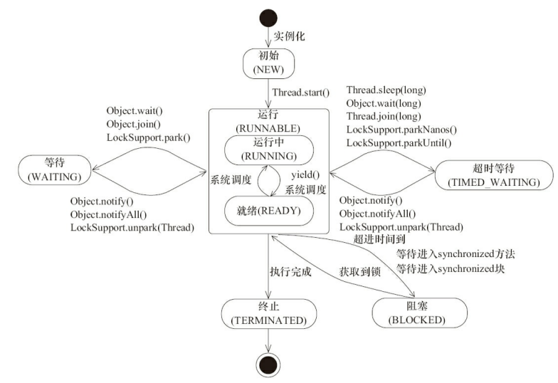

## Java并发

#### 进程

进程是程序的一次执行过程，是系统运行程序和资源分配的基本单位。

#### 线程

线程被称为轻量级进程，一个进程在执行过程中可以产生多个线程，他们共享进程的资源。线程是cpu调度的基本单位。

在Java中，多个线程共享进程的堆和方法区资源，而每个线程都有自己的程序计数器，虚拟机栈和本地方法栈。

#### 进程和线程的区别

* 资源：进程是资源分配的基本单位，线程不拥有资源，但线程可以访问他隶属的进程的资源。
* 调度：线程是cpu调度的基本单位，同一进程中的线程切换不会导致线程切换，但从一个进程的线程切换到另一个进程的线程就会导致进程的切换。
* 开销：进程涉及资源的分配和回收，进程的创建和销毁的开销会远大于线程。进程切换涉及进程cpu环境的保存和新调度进程cpu环境的设置，线程只需要保存和设置少量的寄存器内容，所以切换的时候进程的开销也会远大于线程。
* 通信：进程通信需要借助IPC，线程可以直接通过读写进程中的数据进行通信。

#### 线程的生命周期

操作系统中线程的状态：新建，就绪，运行，等待，结束。

Java的Thread类中有一个State枚举类，定义了Java线程的6种状态。

| 状态         | 说明                                                         |
| ------------ | ------------------------------------------------------------ |
| new          | 初始状态。线程被创建，但还没调用其start方法                  |
| runnable     | 运行状态。Java把操作系统线程的就绪和运行状态都称为运行状态   |
| blocked      | 阻塞状态。表示线程阻塞于锁（synchronized）                   |
| waiting      | 等待状态。当调用Object.wait、Thread.join、LockSupport.park且无限定等待时间 |
| time_waiting | 超时等待状态。Thread.sleep、Object.wait、Thread.join、LockSupport.parkNanos\|parkUntil |
| terminated   | 终止状态。线程已执行完成                                     |

#### 线程状态转化



#### 上下文切换

当前线程在执行完cpu时间片之后切换到另一个线程之前会先保存自己的状态，下次再切换回来的时候可以再加载这个线程的状态。

#### 线程死锁

线程A持有资源1，线程B持有资源2，他们同时都想申请对方的资源，这两个线程都在互相等待对方释放资源，而且会无限的等待下去，就出现了死锁。

##### 避免线程死锁

1.一次性申请所有资源。

2.占用部分资源的线程进一步申请其他资源时，如果申请不到就主动释放它占有的资源。

3.按顺序申请资源。释放资源反向释放资源。

#### 多线程使用

1.继承Thread，重写run方法

2.实现Runnable接口，实现run方法

3.实现Callable接口，实现call方法

```java
public class CallableTest implements Callable<String> {
    @Override
    public String call() throws Exception {
        return "ko no Dio da !";
    }
}

class CallableTestMain{
    public static void main(String[] args) {
        CallableTest callableTest = new CallableTest();
        FutureTask<String> futureTask = new FutureTask<>(callableTest);
        Thread thread = new Thread(futureTask);
        thread.start();
        try {
            System.out.println(futureTask.get());
        } catch (InterruptedException | ExecutionException e) {
            e.printStackTrace();
        }
    }
}
```

#### volatitle

* JMM

  JMM是一个抽象模型。在这个模型里面，所有的共享变量都存储在主存，每个线程还有自己的工作内存，各个线程的工作内存保留了被线程使用到的变量副本，线程对变量的操作都是在工作内存完成的，不能直接操作主内存中的变量，而且，不同线程之间不能直接访问对方工作内存的变量，需要通过主存中转来实现。

工作内存对应cpu缓存，主存对应主内存。

* cpu缓存

  cpu中需要cpu高速缓存去解决内存访问过慢的问题。cpu一般有三级缓存，然后通过一些缓存一致性协议来保证缓存之间的数据一致性。

* 缓存一致性协议 MESI

  当cpu写数据的时候，如果发现操作的变量是共享变量的话，也就是说这个变量在其他cpu的缓存中也存在一个副本，那么他会发出信号去通知其他cpu将这个变量的缓存行设置为无效状态，这时候如果其他cpu需要读取这个变量时，会发现缓存该变量的缓存行是无效的，所以就会去主存重新读取。

  每个处理器通过嗅探总线上传播的数据来检查自己的缓存值是不是过期了，当处理器发现自己缓存行的共享变量被修改了就会将当前的缓存行设置为无效，当处理器需要对这个变量进行操作的时候就得重新去主存读取。

  如果大量使用volatitle的话，会产生总线风暴。在多核处理器中，各个cpu核心通过总线和内存进行数据交互，如果大量使用volatile的话，那么每个cpu核心就需要不断地进行总线嗅探，无效的交互会导致总线的带宽达到峰值，使得cpu处理效率下降。（cas也会导致总线风暴）

* volatile特性

  1.volatile保证了可见性

  当一个变量被volatile修饰时，其中一个线程在其工作内存中对这个变量进行修改时，这个变量会被立即刷新回主内存，而且会使得其他线程的工作内存中这个变量的副本失效，就强制其他线程读取这个变量的时候得去主存读取，这时候读取到的值就是最新值。

  2.volatile保证了有序性

  JMM允许编译器和处理器进行指令的重排序，但是规定了as-if-serial，就是不管怎么重排序，程序的执行结果都不会改变，这是在单线程环境下可以保证的，但是在并发环境下就容易出问题。volatile就能防止指令重排序，他是通过内存屏障实现的。Java编译器会在生成指令序列时在一些位置上插入内存屏障的指令来禁止指令重排序。会在volatile变量写操作的前后加入内存屏障，会在volatile变量读操作后面加上两个内存屏障。

  * 重排序带来的问题

    双重检查单例

    new操作不为原子操作，分为三步

    >  1.分配内存空间
    >
    > 2.实例化
    >
    > 3.返回地址给引用

    若 2 3 重排序则会先返回地址给引用，这时候对象还未实例化或者说实例化不完全，这时候另一个线程判	断singleton ！= null 就直接返回了，但这个对象还是个半成品就会有问题了。

```java
    public class Singleton {

        private static volatile Singleton singleton;

        private Singleton(){}

        public static Singleton getInstance() {
            if (singleton == null) {  
                synchronized(Singleton.class) {
                    if (singleton == null) { 
                        singleton = new Singleton();
                    }
                }
            }
            return singleton;
        }
    }
```

3. volatile无法保证原子性

* volatile实现

  volatitle是通过lock指令实现的，当一个核心需要写volatile变量的时候，他会发出lock指令，然后对自己核心的缓存行进行写操作，然后将这个变量的数据写回到主存里面。这时候其他核心通过总线嗅探可以知道这个变量已经发生了变化，然后他们将自己的缓存行设置成无效状态，需要读取的时候会到主存重新读取这个变量。（lock指令也有防止两端指令重排序的功能）

#### synchronized

* 使用场景

  1.修饰实例方法，获取当前的this对象的锁

  2.修饰静态方法，获取当前类的Class对象的锁

  3.修饰代码块，指定一个对象，获取这个对象的锁

  如果多个同步代码块使用的是同一个对象作为锁的话，那么在一个时间点里只有一个线程能够执行到这些同步代码。

* 实现

  当编译的时候会使用monitorenter和monitorexit进行同步，当一个线程需要执行同步代码的时候需要去获取相应对象的monitor，最开始的时候，monitor的线程的进入数是0，当一个线程执行monitorenter，并且成功进入的时候就会称为这个monitor的所有者，这时候monitor的进入数就为1，如果再次进入这个monitor的时候，进入数会再加1。当退出的时候，进入数就会减1，直到monitor的进入数是0的时候，其他线程才能持有这个monitor。这是synchronized的可重入。当多个线程同时竞争monitor的时候，只有一个线程能获取monitor，其他没获取到monitor的线程会变成blocked状态然后被丢到一个同步队列中，当monitor进入数变为0的时候，同步队列里的线程就会重新去竞争monitor。

* 特性

  1.原子性：同一个时间点只有一个线程持有对象锁，保证原子性。

  2.可见性：当执行monitorenter时，会将共享变量设置为无效，使当前线程能够重新去主存读取到最新值，当执行monitorexit的时候，会将当前线程的工作内存里的共享变量刷回主存中。

  3.有序性：一种解释是synchronized使得线程排队去执行同步代码块，所以能保证有序，但是synchronized修饰的同步代码块中也是能发生指令重排序的，所以单例双重检查需要使用volatile来避免指令重排序。

* 优化

  jdk6的时候对synchronized进行过优化，加入了锁升级的过程，锁只要的四种状态分别是：无锁，偏向锁，轻量级锁和重量级锁，锁可以从偏向锁升级成轻量级锁，再从轻量级锁升级成重量级锁，但锁的升级是单向的，只能升级，不能降级。

* 锁升级过程

  在对象的对象头中存在Mark Word结构，默认无锁的状态下存储的是hashcode，分代年龄和锁标志位等一些信息，然后这个Mark Word是可复用的，也就是说在对象的不同时期，Mark Word里存储的信息也是不一样的。

  1.最开始没有被线程访问的时候为无锁状态，这时候一个线程执行同步代码的时候，synchronized就会升级为偏向锁状态，当一个线程访问同步代码块并获取偏向锁的时候，会在Mark Word里记录偏向锁偏向的线程ID，在线程进入和退出同步块时不需要通过cas来加锁和解锁，只需要检测一下Mark Word中存储的是否是当前线程的ID就行。偏向锁是为了应对一段同步代码老是只有一个线程在频繁访问的时候提高性能，减少不必要的cas开销。

  2.当锁是偏向锁的时候，这时候另一个线程尝试竞争锁，那么偏向锁就会升级为轻量级锁，其它线程竞争轻量级锁的时候会通过cas去尝试获取锁，不会阻塞，能提升性能。

  3.在轻量级锁时，如果线程自旋等待锁超过一定的次数之后，或者一个线程持有锁，另一个在等待锁，第三个到来的时候轻量级锁就会升级为重量级锁。重量级锁会使所有等待锁的线程进入阻塞状态，阻塞线程和唤醒线程的时候，操作系统需要进行系统调用，开销会增大。

#### 悲观锁

悲观锁在操作数据的时候持悲观态度。认为其他人也会同时操作数据，所以在操作数据的时候要将数据锁住，在上锁期间，其他人不能访问到这个数据，直到操作完成之后才会将锁释放。在Java中，synchronized，ReentrantLock都是悲观锁的思想。

#### 乐观锁

乐观锁在操作数据的时候持乐观态度。认为其他人不会同时修改数据，所以操作数据的时候不会上锁，只是在执行期间判断别人是否修改了数据，如果在操作数据期间别人修改了数据就放弃修改。乐观锁能使用版本号或者CAS去实现，在Java中的atomic包就是使用CAS，是乐观锁的思想。

#### 乐观锁和悲观锁的应用场景

乐观锁适合读多写少的场景，悲观锁适合写多的场景。

#### 乐观锁的实现

* 版本号

  在数据库中加上一个版本号字段，表示数据被修改的次数，数据如果被修改了就版本号加1，读取数据的时候顺便把版本号读出来，然后修改的时候判断说此时的版本号和我们刚才读取的版本号是否相同，如果相同就说明在这段时间里没有其他线程修改数据，那么就写入数据，然后版本号加1，如果不相同就说明在这段时间里有其他线程修改了数据，那么就放弃或者重试。

* CAS

  compare and swap，比较替换。CAS有三个操作数，分别是内存值，期待值和修改值。进行CAS操作的时候会先比较一下这个内存中的值和我们期待的值是不是相等，如果相等就说明在这段时间里面没有其他线程修改，那么就将内存值替换成我们的修改值。CAS是一个原子性操作，是依赖cpu实现的。

  CAS会出现ABA问题，解决方法是使用版本号或者时间戳。

  Java原子类底层使用compareAndSwapXXX的方法，传入参数是（哪个对象，偏移值，期待值，修改值）

#### 乐观锁的缺点

循环开销大，如果一直CAS失败的话就会一直循环，会给cpu带来很大的负担。

#### ThreadLocal

ThreadLocal作为线程独享的变量，自己通过ThreadLocal存储的变量只有自己的线程才能访问到。

* ThreadLocal的原理

  每一个Thread对象内部都会维护一个ThreadLocalMap，通过一个ThreadLocal对象存值的时候使用的是这个ThreadLocal对象为key，去存到自身线程维护的ThreadLocalMap里面的，实现线程与线程之间的隔离。

* 应用场景

  ThreadLocal能存储当前数据库连接，传值，session管理。

* 细节

  key为弱引用，value为强引用。说是为了去应对内存泄漏，就是当ThreadLocal对象失去外部的强引用的时候，这个ThreadLocal对象能被回收，这时候ThreadLocalMap中以这个对象为key的Entry，他的key就变成了null，然后ThreadLocal在set，get方法都会对这个key为null的Entry去进行处理。但一般用完之后就手动remove吧。

#### ThreadPoolExecutor

* 核心参数

```java
	public ThreadPoolExecutor(int corePoolSize,//核心线程数                    
                              int maximumPoolSize,//最大线程数
                              long keepAliveTime,//当线程数超过核心线程数时，超过该时间，非核心线程被销毁
                              TimeUnit unit,//时间单位
                              BlockingQueue<Runnable> workQueue,//阻塞队列，当新任务来的时候会判断当前运行的线程是否达到了核心线程数，达到就放在队列中
                              ThreadFactory threadFactory,//用于创建线程
                              RejectedExecutionHandler handler//拒绝策略
                             ) {
        if (corePoolSize < 0 ||
            maximumPoolSize <= 0 ||
            maximumPoolSize < corePoolSize ||
            keepAliveTime < 0)
            throw new IllegalArgumentException();
        if (workQueue == null || threadFactory == null || handler == null)
            throw new NullPointerException();
        this.corePoolSize = corePoolSize;
        this.maximumPoolSize = maximumPoolSize;
        this.workQueue = workQueue;
        this.keepAliveTime = unit.toNanos(keepAliveTime);
        this.threadFactory = threadFactory;
        this.handler = handler;
    }
```

* 线程池状态

| 状态       | 说明                                                       |
| ---------- | ---------------------------------------------------------- |
| running    | 运行中状态，能接收新任务                                   |
| shoutdown  | 关闭状态，不再接受新任务，继续处理已保存的阻塞队列中的任务 |
| stop       | 不接受新任务，不处理队列中的任务，会中断正在处理任务的线程 |
| tidying    | 所有任务终止，workCount（有效线程数）为0                   |
| terminated | 在terminated方法执行后变为该状态                           |


* 任务调度

  1.检测线程池状态，如果不为Running直接拒绝。

  2.如果工作线程数小于核心线程数的话就将提交的任务作为firstTask去add一个Worker

  3.如果工作线程数大于等于核心线程数的话，如果阻塞队列没满，就将这个任务扔到阻塞队列里面（源码里面做了双重检查，避免说把任务放进队列里的过程中，线程池状态改变还有预防线程池里的线程死光）

  4.如果阻塞队列满了，然后工作线程数大于等于核心线程数，而且工作线程数小于最大线程数的时候，就将新提交的任务作为firstTask去add一个Worker。

  5.如果工作线程数达到最大线程数，而且阻塞队列也满了的话就会去执行拒绝策略。

addWorker

做一些线程池状态的判断，然后新建一个Worker，然后调用Worker里面线程的start方法。run方法走的是runWorker方法

runWorker

runWorker会先执行传入的firstTask，执行完成或者说firstTask为空的时候就会去getTask去阻塞队列里面获取任务，在getTask方法里面会根据一些状态去判断是要阻塞当前的线程还是返回null，返回null的话，线程就会退出然后死亡。

* 阻塞队列

| 名称                  | 描述                                                         |
| --------------------- | ------------------------------------------------------------ |
| ArrayBlockingQueue    | 数组实现，先进先出。支持公平锁和非公平锁，需要传入容量大小   |
| LinkedBlockingQueue   | 链表实现，先进先出。默认长度为Integer.MAX_VALUE              |
| PriorityBlockingQueue | 堆实现，支持按优先级排序。无界                               |
| DelayQueue            | 延迟队列，在创建元素时可以指定经过多久才能获取到当前元素     |
| SynchronousQueue      | 一个不存储元素的阻塞队列，每一个put操作必须等待take操作，否则不能添加元素。支持公平锁和非公平锁。这个阻塞队列的一个使用场景是在Executors.newCashedThreadPool()，这个线程池在新任务到来的时候创建新线程，如果有空闲线程的话就会重复使用，否则超过60秒就会被回收 |
| LinkedTransferQueue   | 链表实现，无界，相比于其他阻塞队列增加了transfer和tryTransfer方法 |
| LinkedBlockingDeque   | 链表实现，双向阻塞队列，双端都可以添加和移除元素             |

transfer：

1. 当有消费者线程阻塞等待时，调用transfer方法的生产者线程不会将元素存入队列，而是直接将元素传递给消费者；
2. 如果调用transfer方法的生产者线程发现没有正在等待的消费者线程，则会将元素入队，然后会阻塞等待，直到有一个消费者线程来获取该元素。

tryTransfer：

当生产者线程调用tryTransfer方法时，如果没有消费者等待接收元素，则会立即返回false。该方法和transfer方法的区别就是tryTransfer方法无论消费者是否接收，方法立即返回，而transfer方法必须等到消费者消费后才返回。

* 拒绝策略

当任务到来时，如果当前运行的线程数达到最大线程数，而且阻塞队列也满了的时候就会触发拒绝策略。

> **`ThreadPoolExecutor.AbortPolicy`**：抛出 `RejectedExecutionException`来拒绝新任务的处理。
>
> **`ThreadPoolExecutor.CallerRunsPolicy`**：调用执行自己的线程运行任务，也就是直接在调用`execute`方法的线程中运行(`run`)被拒绝的任务，如果执行程序已关闭，则会丢弃该任务。因此这种策略会降低对于新任务提交速度，影响程序的整体性能。如果您的应用程序可以承受此延迟并且你要求任何一个任务请求都要被执行的话，你可以选择这个策略。
>
> **`ThreadPoolExecutor.DiscardPolicy`：** 不处理新任务，直接丢弃掉。
>
> **`ThreadPoolExecutor.DiscardOldestPolicy`：** 此策略将丢弃最早的未处理的任务请求。

* 线程池异常处理问题

  1.submit，底层是Future，线程不会死亡。

  2.UncaughtExceptionHandler，jvm调用，线程死亡。

* 线程池的应用场景

  快速响应用户请求

  比如说要查询一个商品，我们需要对商品的价格，库存，优惠，图片的信息聚合起来再展示给用户，如果串行获取的话就会比较慢，我们可以用线程池，把获取价格，获取优惠，获取库存去包装成一个个任务，然后提交给线程池，让任务并行的执行，缩短响应的时间。这个场景下，因为是要快速嘛，所以线程池的话不应该设置队列去缓冲并发任务，需要调高核心线程数和最大线程数去创造尽可能多的线程去快速完成任务。

  可能会产生的问题

  核心线程数，最大线程数设置过小，如果流量过大的话容易导致频繁地触发拒绝策略。

  阻塞队列容量设置过大，容易导致任务在队列中堆积，最大线程数不生效，导致请求超时。

#### FutureTask

运行我们传入的Callable的call方法，然后将返回值或者异常存储在这个FutureTask的outcome里面，其他的线程能调用这个FutureTask的get方法获取outcome的值。当使用get去获取值的时候，如果这时候call方法还没执行完，还没得到结果，就会新建一个WaitNode节点，然后入队，然后将这个线程挂起。当计算完成得到结果的时候就会去唤醒等待队列里面的线程。

#### AQS

* AQS介绍

  AQS全称是AbstractQueuedSynchronizer，是一个用来构建锁和同步器的一个框架，AQS提供的是一个线程的排队阻塞的一个功能，这个功能在很多的并发工具都需要使用，所以把这一部分相同的逻辑抽取出来，搞了个AQS。使用AQS去实现同步器的话就不需要再去关心线程的排队和阻塞，只需要继承AQS，然后重写一下钩子方法就能实现出自己的一个同步器。在Java中的ReentrantLock，Semaphore，ReentrantReadWriteLock都是基于AQS实现的。

  AQS内部使用一个volatile修饰的int变量来表示资源的状态，变量名叫state。AQS内部维护了一个先进先出的双端队列，用于存储被阻塞的线程的节点，使用head指针和tail指针标识队列的头部和尾部。节点还分是独占的还是共享的，比如ReentrantLock的节点就是独占的，Semaphore的节点是共享的。

  AQS获取资源的核心方法是acquire方法，在acquire里面有一个tryAcquire方法，这是一个钩子，需要子类重写具体的资源的获取逻辑。release方法是释放资源的方法，里面有tryRelease方法，需要子类重写释放资源的具体逻辑。

* AQS线程排队和阻塞的流程

  AQS使用acquire方法获取资源，使用子类重写的tryAcquire方法去做资源获取的具体的逻辑，获取资源一般都是用cas去修改state的值。如果没法获取到资源的话就需要对线程进行一个排队和阻塞。

  如果资源获取失败就会走addWaiter方法去生成一个等待节点然后入队，然后走acquireQueued方法去让队列的头节点的下一个节点如果是当前线程，就继续调用tryAcquire方法去争抢资源，这个方法还能让线程阻塞，当线程的前一个节点状态是signal的时候就会阻塞当前节点的线程。

  为什么是头节点的下一个节点？

  在线程入队的时候，如果队列里面没有元素的话是先初始化一个默认的头节点的，之后队列里的节点获取到资源之后会把自己设置为头节点，表示当前持有资源的线程。头节点的下一个节点才是真正需要争抢资源的线程。

  AQS使用release方法去释放资源，会调用子类实现的tryRelease方法去做资源释放的具体逻辑，然后会判断头节点是不是初始化状态，如果不是的话就表明后续节点可能被阻塞，需要唤醒。唤醒的时候，如果下一个节点不是cancelled节点的话就唤醒，如果是的话就需要从队列从后往前扫，唤醒队列里面第一个不是cancelled的节点。

  为什么是从后往前扫？

  1.在acquireQueue方法里面，如果循环抛异常的话会进到取消节点的方法，取消节点怎么取消，他分三种情况，主要是操作被取消节点的next指针。

  //保留 2.节点入队的时候，是先操作pre指针，如果cas设置尾指针成功后才操作next指针

#### synchronized与Lock

1.synchronized在jvm层面实现的加锁解锁，Lock是在代码层面实现的。

2.synchronized会自动释放锁，Lock需要显示释放锁。

3.synchronized不能响应中断，Lock能响应中断。

4.Lock能通过tryLock得知是否获取锁成功，synchronized无法得知是否获取锁成功。

5.Lock功能更多，能区分公平非公平，可重入，还能使用condition去定向的阻塞和唤醒线程，还能分读写锁。

一般使用Lock。

#### Lock的种类

1.ReentrantLock，互斥锁

2.ReentrantReadWriteLock，分读写锁，读读不互斥，读写互斥，写写互斥

读写锁在读操作多的情况下容易出现写线程饥饿的情况，可以使用公平锁去避免，但会牺牲吞吐量。

1.8引入StampedLock对读写锁进行增强。

3.StampedLock

**在读的时候如果发生了写，应该通过重试的方式来获取新的值，而不应该阻塞写操作。这种模式也就是典型的无锁编程思想，和CAS自旋的思想一样**。这种操作方式决定了StampedLock在读线程非常多而写线程非常少的场景下非常适用，同时还避免了写饥饿情况的发生。

读，写，乐观读

不可重入，不支持Condition

* Condition原理

  在 Condition 中， 维护着一个队列，每当执行 await 方法，都会根据当前线程创建一个节点，并添加到尾部。

  然后释放锁，并唤醒阻塞在锁的 AQS 队列中的一个线程，然后再将自己阻塞。

  在被别的线程signal唤醒后，将刚刚这个节点放到 AQS 队列中，然后去排队拿锁，拿到锁之后就从await方法返回。

#### Semaphore

内部有一个继承了AQS的同步器，这个同步器重写了tryAcquireShared方法，他通过cas获取资源，当资源小于自己要获取的资源的时候就返回负数，线程排队。

#### CountDownLatch

内部是一个继承了AQS的实现类Sync，实现的是tryAcquireShared方法和tryReleaseShared方法，需要注意的是构造器中的**计数值（count）实际上就是闭锁需要等待的线程数量**。这个值只能被设置一次，而且CountDownLatch**没有提供任何机制去重新设置这个计数值**。

使用，设置CountDownLatch的值 CountDownLatch countDownLatch = new CountDownLatch(3);

线程调用await挂起，其他线程完成工作调用countDownLatch.countDown();当值是0的时候，挂起的线程从await方法返回。

#### 并发容器

##### 1.CopyOnWrite容器

CopyOnWriteArrayList和CopyOnWriteArraySet 

CopyOnWrite是一种写时复制的思想，当我们需要向容器里写元素的时候，不是直接添加到容器里面，而是将当前容器复制一个副本，在副本里面进行我们的操作，之后再将引用指向副本。当读元素的时候就是直接去原容器里读取就行。

优点：适用于读多写少的场景，因为读操作是没加锁的，所以能大幅地增强读的性能。

缺点：1.需要复制，会占用内存 2.会出现短时间的数据不一致

##### 2.ConcurrentHashMap

* 1.7使用分段数组加链表实现，对整个桶数组分成若干个Segment，每个Segment就是一把锁，每一个Segment存储容器中的一部分数据，多线程访问不同Segment的数据时不会产生锁冲突，降低了锁粒度，提高并发度。对元素进行操作的时候会先定位到对应的Segment获取到锁只后进行操作。

  Segment是一个内部类，继承了ReentrantLock，还维护了一组HashEntry用于存储键值对数据。默认16个Segment。

  size操作先是乐观的，不加锁，然后比较两次获得的结果，如果一致的话就返回，如果不一致那么就会去重试。当重试到一定的阈值的时候就会变成悲观的，加锁然后计算size再返回。（size操作先尝试不加锁，如果连续两次不加锁操作得到的结果是一致的话，那么就可以认为这个结果是正确的，如果尝试次数超过三次的话就需要对每个Segment加锁。）

* 1.8取消了分段锁，采用和HashMap类似的数组链表红黑树的结构，同时使用cas和synchronized保证并发安全。以链表或者红黑树的首节点为锁，所以只要不产生hash冲突的话就不会产生并发。

put流程

1.先判断数01组是否为空，空的话就初始化数组

2.通过key的hash值计算出对应的hash桶，如果桶的头节点为空，那么就cas插入到头节点

3.如果头节点正在扩容，那就调用helpTranfer帮助扩容

4.都不是的话，那么就以头节点为锁，去进行链表或者红黑树的插入，如果链表长度超过8的话会进行树化操作

5.判断是否需要扩容

扩容流程

ConcurrentHashMap是支持并发扩容的，他会将table进行拆分，每一个线程负责一个区间，默认一个处理区间的话是16。然后这个线程会对自己区间里，每一个桶里的链表分别复制两份，一个部分是高位为1的，一部分是高位为0的，高位为0的话那么直接放在新数组的原下标就行了，高位为1的话就需要去放到新下标。在节点复制完成后，会使用ForwardingNode节点去代替原来的hash桶的头节点，表示这个桶已经被处理过了。

如果一个线程helpTranfer发现自己不需要负责任何区间的时候，就直接返回nextTable，外部putVal方法拿到nextTable之后替换掉自己原先的局部变量tab的值，然后又一层循环去做key和value的插入。

get流程

get是不加锁的，他首先会去通过hash值去计算对应的hash桶，如果头节点符合的话就直接返回，如果头节点是ForwardingNode节点，那么就说明这时候正在扩容，那么就调用ForwardingNode的find方法去nextTable查找节点，如果都不符合的话就去查找链表或者红黑树。

为什么不用加锁？

Node节点的value和next使用的是volatile修饰，保证了可见性，当线程修改了Node的时候，其他线程就能感知到。ConcurrentHashMap扩容的时候使用的是复制节点的方式而不是转移节点，当节点复制到新数组完成之后就会将原来的数组的hash桶的头节点设置为ForwardingNode节点，这里的设置使用的是Unsafe类去保证了数组元素的可见性。线程看到是ForwardingNode节点那么就直接调用这个节点的find方法直接去新链表找就行了。

***

## 多线程的优缺点？

优点：能适当提高程序的执行效率，缩短程序的响应时间。

能适当的提高cpu资源的利用率。

缺点：过多线程会占用大量的内存空间。

如果线程数过多的话，会导致线程切换的成本很高。

会使程序的设计更加复杂，要考虑线程共享变量的线程安全问题。

## 多线程的使用场景

1. tomcat容器，每当一个请求到达的时候，都会将这个请求交给一个线程，然后去执行对应的servlet。
2. 多线程下载文件。
3. 后台任务，定时发送邮件。
4. 生产者消费者模型。
5. 处理大批量的数据，可以把数据进行分割，然后交给不同的线程执行，最后将结果聚合。

## 线程数是不是越多越好？

不是，线程的切换时存在开销的，线程越多，线程切换的成本越高。

## 线程数和cpu数之间的关系？

对于CPU密集型计算任务，线程数 = CPU核心数 + 1

对于I/O密集型计算任务，线程数 = 2 * CPU核心数

对于普通任务，线程数 = N（CPU核心数） * （1 + WT（线程等待时间） /  ST（线程时间运行时间））


