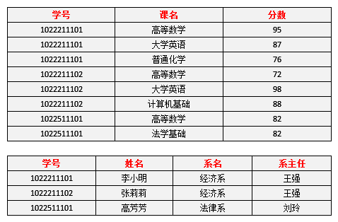
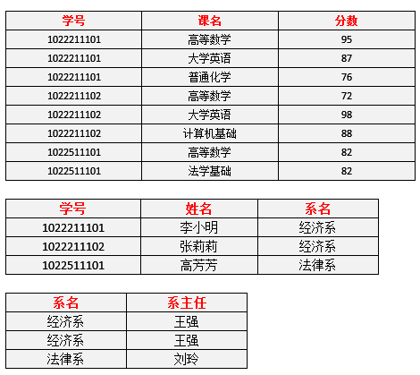
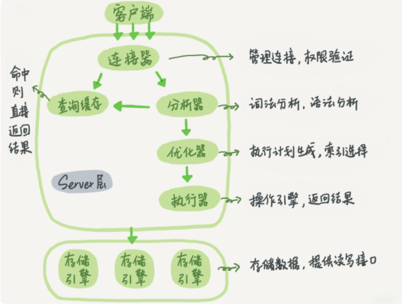

数据库三大范式

第一范式：

要求确保每列的原子性，即每一列都是不可拆分的。

不满足第一范式会导致修改数据困难，需要去做数据的分离。

第二范式：

非主键列都需要完全依赖主键。

不满足第二范式会导致数据的冗余，修改困难。

数据冗余过大：每一名学生的学号、姓名、系名、系主任这些数据重复多次。每个系与对应的系主任的数据也重复多次。

插入：新建了一个系，还没收学生，还没考试，没法将系记录起来。

删除：如果学生信息删除了，那么系和系主任也随着消失了。

修改麻烦：小明转系了，那么需要修改三条数据。

修改后：

删除和插入并无改进，原因在于还存在系主任依赖于系名，需要进一步拆分满足第三范式。

第三范式：

非主键列不能依赖于其他非主键列

修改后：

插入删除已改进。

****

MySQL架构

## MySQL ACID 实现

a：原子性

使用commit和rollback实现，Innodb使用undoLog实现回滚，如果正在进行一个事务，Innodb会把这个事务的修改记录到undoLog中，如果需要回滚则使用这个事务的undoLog进行事务回滚。

d：持久性

Innodb使用redolog实现持久性。MySQL对于数据的修改，为了提升效率，不是直接写到磁盘的，如果每次修改都写到磁盘是随机io，性能很差。所以对于数据的修改会先写到redolog上然后写入内存，然后在数据库空闲的时候把redolog上记录的数据刷到磁盘里面。当数据库宕机的时候能通过redolog恢复，保证了持久性。

I：隔离性

> 读未提交（导致脏读，不可重复读，幻读）
>
> 读提交（导致不可重复读，幻读）
>
> 可重复读（导致幻读）
>
> 串行化

使用行锁，表锁，mvcc实现。

1. 读未提交，写操作就直接写，没有加锁。
2. 读提交，写操作加锁，事务提交就释放锁。
3. 可重复读，写操作加锁，事务提交释放锁。读操作使用mvcc，读操作不加锁，使用事务id，事务id是自增的，每个事务只能读到其他在他之前已经提交的事务。所以innodb的可重复读级别下的普通读是可以解决幻读问题的，但当前读就没法解决了。
4. 串行化，串行化就是每个事务串行。

c：一致性

通过以上三点保证一致性和业务层面保证一致性。

