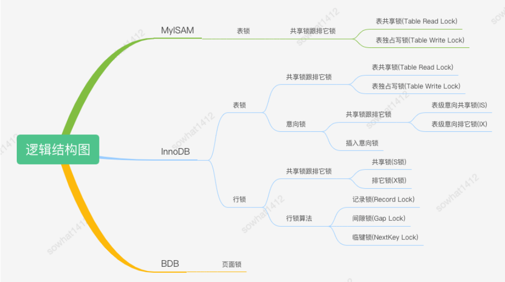
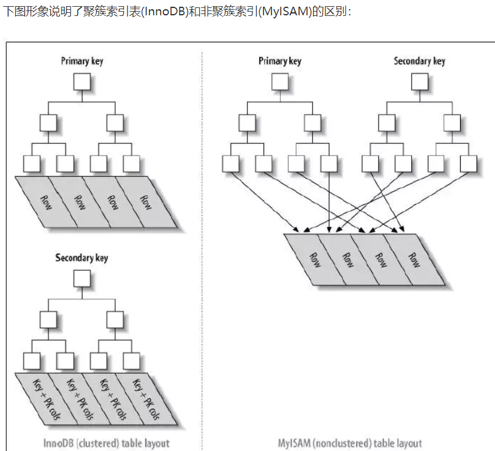
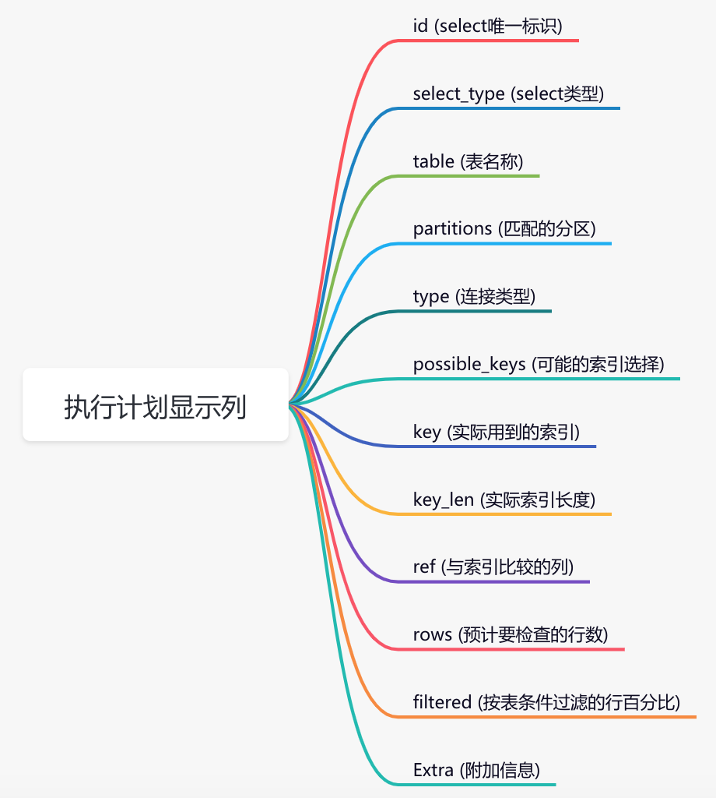

## 数据库三大范式

第一范式：

要求确保每列的原子性，即每一列都是不可拆分的。

不满足第一范式会导致修改数据困难，需要去做数据的分离。

第二范式：

非主键列都需要完全依赖主键。

不满足第二范式会导致数据的冗余，修改困难。

数据冗余过大：每一名学生的学号、姓名、系名、系主任这些数据重复多次。每个系与对应的系主任的数据也重复多次。

插入：新建了一个系，还没收学生，还没考试，没法将系记录起来。

删除：如果学生信息删除了，那么系和系主任也随着消失了。

修改麻烦：小明转系了，那么需要修改三条数据。

修改后：

删除和插入并无改进，原因在于还存在系主任依赖于系名，需要进一步拆分满足第三范式。

第三范式：

非主键列不能依赖于其他非主键列

修改后：

插入删除已改进。

****

## MySQL架构

1. 连接器与客户端建立TCP连接，验证账号密码。如果认证通过则查找这个用户的权限，正式建立这个数据库连接。（这个连接就依赖此时读到的权限。其中管理员修改了权限需要重新登录才能生效)

   连接分为长连接短链接（连接为MySQL抽象出来的一个能让我们操作数据库服务器的接口，其本质还是TCP连接）。长连接：客户端的操作的复用这条连接。短链接：每次执行完很少的几次操作就断开连接，下次查询再建立。（MySQL会将一些数据绑定到连接对象中，所以一个连接复用太久的话会导致内存占用过大，解决方法是关掉重连或者reset命令让连接恢复到刚建立的样子）

2. 缓存

3. 分析器分析SQL语句，分析语法是否符合规范。

4. 优化器，有多种执行方案能实现目标，那么系统通过优化器选择最优方案。

5. 执行器，先判断下有没有权限，之后根据优化器提供的最优方案调用引擎接口。

## 日志

#### binlog，是Server层实现的，适用于所有引擎，记录所有表数据的修改和表结构变更的逻辑日志

| 模式      | 内容                           | 优势                                                         | 劣势                                                         |
| --------- | ------------------------------ | ------------------------------------------------------------ | ------------------------------------------------------------ |
| statement | 记录引起数据变更的SQL语句      | 没有记录实际数据，日志量少，性能好                           | uuid函数每次执行的结果都是不确定的，使用statement的binlog进行回放必然出现数据不一致 |
| row       | 记录每次变更数据的前后两次数据 | 可以绝对精准的还原                                           | 会导致binlog的体积很大，对于修改记录的字段大的操作来说记录日志的性能损耗很大 |
| mixed     | statement和row两种模式混合     | 一般操作使用statement记录，涉及uuid等不确定的结果使用row模式 |                                                              |

#### redolog，innodb实现的物理日志，用来保证数据库异常重启时数据不丢失和提升数据修改时的效率

物理日志：记录了哪个数据页上做了哪些修改。

1. 数据不丢失：对于数据的修改先写日志，后写内存，再刷脏写磁盘。
2. 提升效率：对于数据的修改，如果每次修改都直接写到磁盘效率很低，因为是随机IO，所以可以写在redolog，写redolog是顺序IO，然后写内存就返回，等待刷脏的时候刷进磁盘。

> 刷脏时机？
>
> 1. 内存不够（LRU）
> 2. redolog不够写
> 3. 数据库空闲
> 4. 正常关闭
>
> 刷脏影响性能：一个查询需要淘汰的脏页个数太多，会导致查询过慢 && redolog写满，更新全部堵住

#### binlog 和 redolog的区别

server innodb 追加 循环 逻辑 物理

#### undolog 回滚日志

1. insert undo log ：插入新纪录的时候产生的undolog，只在事务回滚时需要，在事务提交之后就能丢弃。
2. update undo log ：更新或删除数据时产生的undolog，在事务回滚的时候需要，在快照读的时候也需要，只有在快照读和事务回滚不涉及该日志的时候才能被删除。

## MySQL ACID 实现

a：原子性

使用commit和rollback实现，Innodb使用undoLog实现回滚，如果正在进行一个事务，Innodb会把这个事务的修改记录到undoLog中，如果需要回滚则使用这个事务的undoLog进行事务回滚。

d：持久性

Innodb使用redolog实现持久性。MySQL对于数据的修改，先写日志后写内存再写磁盘。当数据库宕机的时候能通过redolog恢复，保证了持久性。

I：隔离性（脏写在所有隔离级别下都得避免）

> 读未提交（导致脏读，不可重复读，幻读）
>
> 读提交（导致不可重复读，幻读）
>
> 可重复读（导致幻读）
>
> 串行化

1. 读未提交。（读不加锁。写加锁，事务结束释放锁）

2. 读提交。（读sql时快照，已提交的事务可见，其他不可见。写加锁，事务结束释放锁）

3. 可重复读。（读，事务开启时快照。写加锁，使用next-key锁，之前两种都是行锁，事务结束解锁）（MySQL使用快照读和next-key lock解决了幻读）

   >版本未提交，不可见；
   >
   >版本已提交，但是是在视图创建后提交的，不可见；
   >
   >版本已提交，而且是在视图创建前提交的，可见。

   

4. 串行化。（读加共享锁。写加互斥锁，数据冲突时事务为串行执行）

c：一致性

通过以上三点保证一致性和业务层面保证一致性。

## 锁

**IX，IS是表级锁，不会和行级的X，S锁发生冲突。只会和表级的X，S发生冲突**

next-key lock加锁规则里面，包含了两个“原则”、两个“优化”和一个“bug”。

> 原则 1：加锁的基本单位是 next-key lock。希望你还记得，next-key lock 是前开后闭区间。
>
> 原则 2：查找过程中访问到的对象才会加锁。
>
> 优化 1：索引上的等值查询，给唯一索引加锁的时候，next-key lock 退化为行锁。
>
> 优化 2：索引上的等值查询，向右遍历时且最后一个值不满足等值条件的时候，next-key lock 退化为间隙锁。
>
> 一个 bug：唯一索引上的范围查询会访问到不满足条件的第一个值为止。

## 索引

#### B树和B+树的区别

（B+树具体的数据都存在叶子节点上，同时叶子节点还有前后指针）

1. B+树查询效率稳定
2. B+树节点能存储更多的索引值，能进一步压缩树的高度，减少IO次数
3. 前后指针范围查询方便

#### 索引设计的原则

> 1. 服从最左原则
> 2. 避免索引冗余
> 3. 选用区分度高的字段建索引

#### 聚簇索引和非聚簇索引

#### explain

[explain](https://mp.weixin.qq.com/s?__biz=MzI4NjI1OTI4Nw==&mid=2247488546&idx=1&sn=732ca84abf572196ddf76597fe096969&scene=21#wechat_redirect)

#### innodb 和 Myisam的区别

> 1. InnoDB 支持事务，MyISAM 不支持事务。这是 MySQL 将默认存储引擎从 MyISAM 变成 InnoDB 的重要原因之一；
>
> 2. InnoDB 支持外键，而 MyISAM 不支持。对一个包含外键的 InnoDB 表转为 MYISAM 会失败；  
>
> 3. InnoDB 是聚集索引，MyISAM 是非聚集索引。聚簇索引的文件存放在主键索引的叶子节点上，因此 InnoDB 必须要有主键，通过主键索引效率很高。但是辅助索引需要两次查询，先查询到主键，然后再通过主键查询到数据。因此，主键不应该过大，因为主键太大，其他索引也都会很大。而 MyISAM 是非聚集索引，数据文件是分离的，索引保存的是数据文件的指针。主键索引和辅助索引是独立的。 
>
> 4. InnoDB 不保存表的具体行数，执行 select count(*) from table 时需要全表扫描。而MyISAM 用一个变量保存了整个表的行数，执行上述语句时只需要读出该变量即可，速度很快；    
>
> 5. InnoDB 最小的锁粒度是行锁，MyISAM 最小的锁粒度是表锁。一个更新语句会锁住整张表，导致其他查询和更新都会被阻塞，因此并发访问受限。这也是 MySQL 将默认存储引擎从 MyISAM 变成 InnoDB 的重要原因之一；