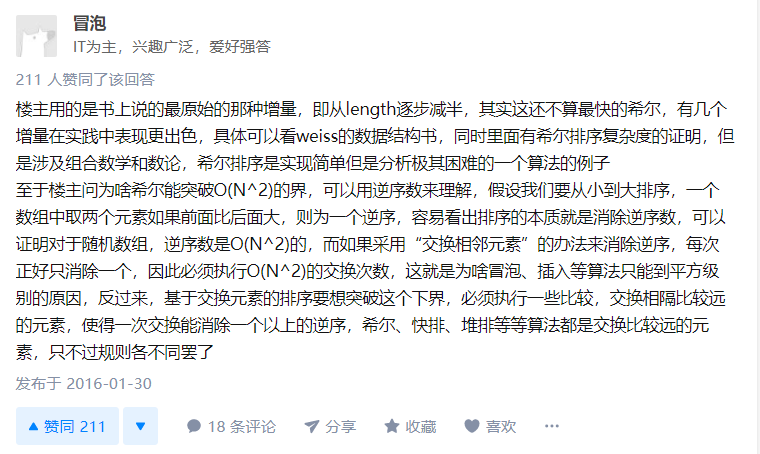
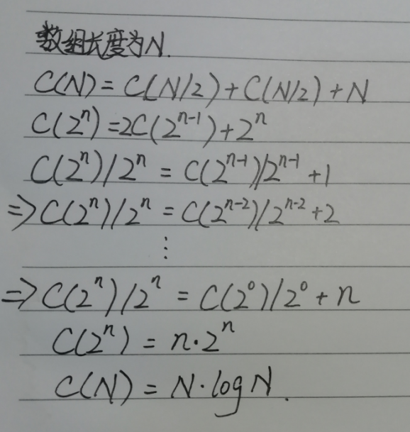

## 1. 冒泡排序

```java
//普通冒泡
public int[] sortArray(int[] nums) {
    for (int i = nums.length - 1; i >= 1; i--) {
        for (int j = 0; j < i; j++) {
            if (nums[j] > nums[j + 1]) {
                int temp = nums[j];
                nums[j] = nums[j + 1];
                nums[j + 1] = temp;
            }
        }
    }
    return nums;
}

//优化冒泡
public int[] sortArray(int[] nums) {
    for (int i = nums.length - 1; i >= 1; i--) {
        //若一次遍历中没有交换元素则说明已经有序，跳出循环！
        boolean flag = true;
        for (int j = 0; j < i; j++) {
            if (nums[j] > nums[j + 1]) {
                int temp = nums[j];
                nums[j] = nums[j + 1];
                nums[j + 1] = temp;
                flag = false;
            }
        }
        if (flag) break;
    }
    return nums;
}
```

| 平均时间复杂度 | 最好情况   | 最差情况 | 空间复杂度 | 稳定性 |
| -------------- | ---------- | -------- | ---------- | ------ |
| O(n^2)         | O(n)已优化 | O(n^2)   | O(1)       | 稳定   |

## 2. 插入排序

```java
public int[] sortArray(int[] nums) {
    for (int i = 1; i < nums.length; i++) {
        for (int j = i; j > 0; j--) {
            if (nums[j] < nums[j - 1]) {
                int temp = nums[j];
                nums[j] = nums[j - 1];
                nums[j - 1] = temp;
            } else {
                break;
            }
        }
    }
    return nums;
}
```

| 平均时间复杂度 | 最好情况 | 最差情况 | 空间复杂度 | 稳定性 |
| -------------- | -------- | -------- | ---------- | ------ |
| O(n^2)         | O(n)     | O(n^2)   | O(1)       | 稳定   |

## 3. 希尔排序

```java
public int[] sortArray(int[] nums) {
    //gap计算无最佳
    int gap = 1;
    while (gap < nums.length) {
        gap = gap * 3 + 1;
    }
    //当gap == 1时为插入排序
    while (gap > 0) {
        for (int i = gap; i < nums.length; i++) {
            int j = i;
            while (j - gap >= 0) {
                if (nums[j] < nums[j - gap]) {
                    int temp = nums[j - gap];
                    nums[j - gap] = nums[j];
                    nums[j] = temp;
                } else {
                    break;
                }
                j = j - gap;
            }
        }
        gap = gap / 3;
    }
    return nums;
}
```

| 平均时间复杂度 | 最好情况   | 最差情况   | 空间复杂度 | 稳定性 |
| -------------- | ---------- | ---------- | ---------- | ------ |
| 小于O(n^2)     | 小于O(n^2) | 小于O(n^2) | O(1)       | 不稳定 |

如何理解希尔排序突破O(n^2) ？



## 4. 归并排序

```java
public int[] sortArray(int[] nums) {
    sort(nums, new int[nums.length], 0, nums.length - 1);
    return nums;
}

private void sort(int[] nums, int[] tempArray, int head, int tail) {
    if (tail <= head) return;
    int mid = (tail - head) / 2 + head;
    sort(nums, tempArray, head, mid);
    sort(nums, tempArray, mid + 1, tail);
    merge(nums, tempArray, head, mid, tail);
}

private void merge(int[] nums, int[] tempArray, int head, int mid, int tail) {
    for (int i = head; i <= tail; i++) {
        tempArray[i] = nums[i];
    }

    int index1 = head, index2 = mid + 1;
    for (int i = head; i <= tail; i++) {
        if (index1 > mid) {
            nums[i] = tempArray[index2];
            index2++;
        } else if (index2 > tail) {
            nums[i] = tempArray[index1];
            index1++;
        } else {
            if (tempArray[index1] <= tempArray[index2]) {
                nums[i] = tempArray[index1];
                index1++;
            } else {
                nums[i] = tempArray[index2];
                index2++;
            }
        }
    }
}
```

| 平均时间复杂度 | 最好情况  | 最差情况  | 空间复杂度 | 稳定性 |
| -------------- | --------- | --------- | ---------- | ------ |
| O(n logn)      | O(n logn) | O(n logn) | O(n)       | 稳定   |



## 5. 快速排序

```java
public int[] sortArray(int[] nums) {
    sort(nums, 0, nums.length - 1);
    return nums;
}

private void sort(int[] nums, int head, int tail) {
    if (head >= tail) {
        return;
    }
    int point = head, start = head, end = tail;
    while (true) {
        while (tail > head && nums[tail] > nums[point]) {
            tail--;
        }
        while (tail > head && nums[head] <= nums[point]) {
            head++;
        }
        if (head >= tail) {
            int temp = nums[point];
            nums[point] = nums[tail];
            nums[tail] = temp;
            point = tail;
            break;
        } else {
            int temp = nums[head];
            nums[head] = nums[tail];
            nums[tail] = temp;
        }
    }

    sort(nums, start, point - 1);
    sort(nums, point + 1, end);
}
```

| 平均时间复杂度 | 最好情况  | 最差情况 | 空间复杂度 | 稳定性 |
| -------------- | --------- | -------- | ---------- | ------ |
| O(n logn)      | O(n logn) | O(n ^ 2) | O(logn)    | 不稳定 |

快速排序在极端情况下（5，4，3，2，1）会导致O(n ^ 2)复杂度，可使用随机取基准点或者打乱数组解决。

时间复杂度证明和归并排序类似。

## 6. 堆排序

```java
class Heap {

    private int[] array;

    private int point = 1;

    Heap(int len) {
        array = new int[len + 1];
    }

    void add(int num) {
        int p = point;
        array[p] = num;
        while (p / 2 > 0) {
            if (array[p / 2] < array[p]) {
                int temp = array[p];
                array[p] = array[p / 2];
                array[p / 2] = temp;
            } else break;
            p = p / 2;
        }
        point++;
    }

    int remove() {
        int answer = array[1];

        array[1] = array[point - 1];
        point--;
        int p = 1;
        while (p * 2 < point) {
            int maxIndex = -1;
            if (array[p * 2] > array[p]) {
                maxIndex = p * 2;
            }
            if (p * 2 + 1 < point && array[p * 2 + 1] > array[p] && array[p * 2 + 1] > array[p * 2]) {
                maxIndex = p * 2 + 1;
            }

            if (maxIndex == -1) break;
            int temp = array[p];
            array[p] = array[maxIndex];
            array[maxIndex] = temp;

            p = maxIndex;
        }
        return answer;
    }
}

//外部堆版
public int[] sortArray(int[] nums) {
    Heap heap = new Heap(nums.length);
    for (int num : nums) {
        heap.add(num);
    }
    for (int i = nums.length - 1; i >= 0; i--) {
        nums[i] = heap.remove();
    }
    return nums;
}

##############################################################################################

//堆排序版
public int[] sortArray(int[] nums) {
        //构建堆
        for (int i = nums.length / 2; i >= 0; i--) {
            sink(nums, i, nums.length - 1);
        }

        for (int i = nums.length - 1; i >= 1; i--) {
            int temp = nums[0];
            nums[0] = nums[i];
            nums[i] = temp;

            sink(nums, 0, i - 1);
        }
        return nums;
    }

    //下沉
    private void sink(int[] nums, int index, int lastIndex) {
        int p = index;
        while (p * 2 + 1 <= lastIndex) {
            int left = p * 2 + 1;
            int right = p * 2 + 2;
            int point = p;
            if (nums[left] > nums[point]) {
                point = left;
            }
            if (right <= lastIndex && nums[right] > nums[point]) {
                point = right;
            }
            if (p == point) break;

            int temp = nums[p];
            nums[p] = nums[point];
            nums[point] = temp;
            p = point;
        }
    }

```

| 平均时间复杂度 | 最好情况  | 最差情况  | 空间复杂度 | 稳定性 |
| -------------- | --------- | --------- | ---------- | ------ |
| O(n logn)      | O(n logn) | O(n logn) | O(1)       | 不稳定 |

## 7. 桶排序

```java
public int[] sortArray(int[] nums) {
    int len = nums.length;
    int min = nums[0];
    int max = nums[0];
    for (int num : nums) {
        if (max < num) max = num;
        if (min > num) min = num;
    }

    //步长
    float section = (float) (max - min) / (float) (len - 1);
    int[][] buckets = new int[len][len];
    int[] pointers = new int[len];
    //入桶
    for (int num : nums) {
        int index = (int) ((num - min) / section);
        buckets[index][pointers[index]] = num;
        pointers[index]++;
    }
    //桶内插入排序
    for (int i = 0; i < buckets.length; i++) {
        int length = pointers[i];
        if (length == 0) continue;

        int[] bucket = buckets[i];
        for (int j = 1; j < length; j++) {
            for (int k = j; k > 0; k--) {
                if (bucket[k] < bucket[k - 1]) {
                    int temp = bucket[k];
                    bucket[k] = bucket[k - 1];
                    bucket[k - 1] = temp;
                } else break;
            }
        }
    }

    //出桶
    int p = 0;
    for (int i = 0; i < buckets.length; i++) {
        int length = pointers[i];
        for (int j = 0; j < length; j++) {
            nums[p] = buckets[i][j];
            p++;
        }
    }
    return nums;
}
```

| 平均时间复杂度 | 最好情况 | 最差情况                       | 空间复杂度 | 稳定性 |
| -------------- | -------- | ------------------------------ | ---------- | ------ |
| O(n)           | O(n)     | 取决于桶内排序算法的时间复杂度 | O(n)       | 稳定   |

## 8. 基数排序

注意负数

| 平均时间复杂度 | 最好情况 | 最差情况 | 空间复杂度 | 稳定性 |
| -------------- | -------- | -------- | ---------- | ------ |
| O(n)           | O(n)     | O(n)     | O(n)       | 稳定   |


