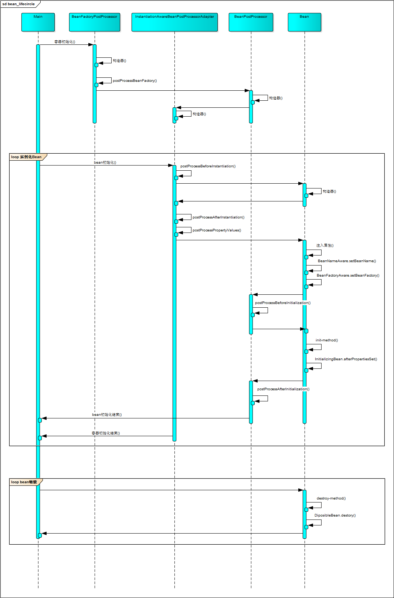
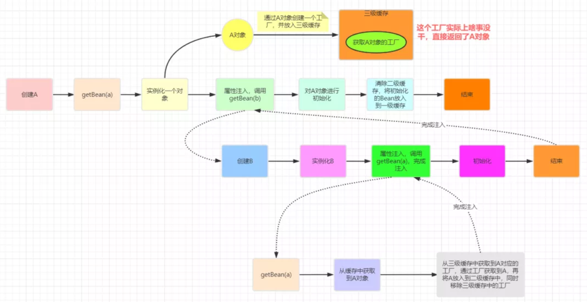
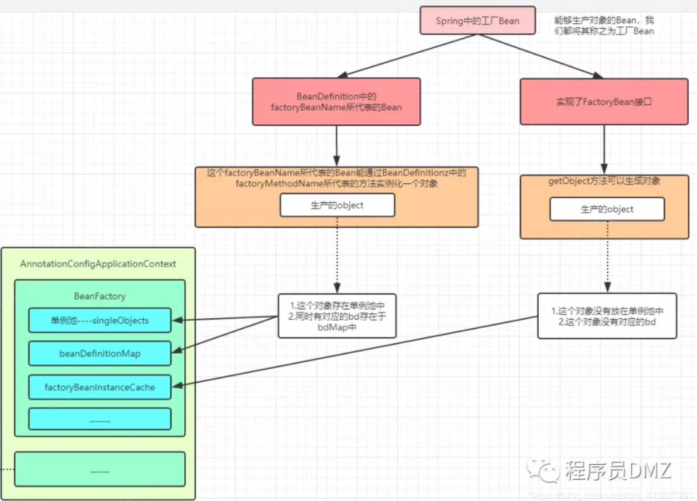
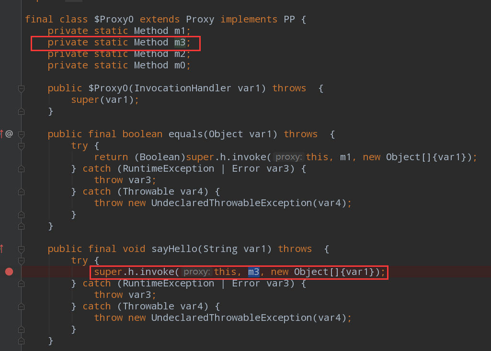

### 什么是Spring IOC

IOC利用反射机制，去实现所谓的控制反转。本来被调用者的实例是由调用者来实现的，利用SpringIOC我们可以将对象交由Spring管理，让Spring帮我们创建对象和管理对象，降低对象与对象之间的耦合。Spring对于IOC控制反转是通过DI依赖注入来实现的，使得能在程序运行阶段向某个对象提供他所需要的其他对象。

### SpringIOC加载流程

以```ClassPathXmlApplicationContext```为例，使用```ClassPathXmlApplicationContext```实例化```ApplicationContext```接口，传入参数是我们的xml文件路径。

> 1.进入```ClassPathXmlApplicationContext```的构造方法，最终会走他的父类```AbstractApplicationContext```的refresh方法。
>
> 2.refresh方法会先new一个```DefaultListableBeanFactory```，之后读取和解析我们路径中的xml文件，然后将我们xml文件中配置的类信息解析成```BeanDefinition```，再放到```DefaultListableBeanFactory```的beanDefinitionMap中，也就是将我们配置的Bean进行一个注册。
>
> 3.回到refresh方法中，接下来会执行postProcessBeanFactory方法注册```BeanFactoryPostProcessor```，postProcessBeanFactory方法是Spring提供的第一个扩展点。
>
> 4.调用上一步注册的```BeanFactoryPostProcessor```的postProcessBeanFactory方法，一般可以在这个方法里去修改已经注册的```BeanDefinition```类信息。
>
> 5.注册```BeanPostProcessor```，这是Spring提供的第二个扩展点。
>
> 6.注册一些监听，事件啥的。
>
> 7.会去实例化我们配置的非懒加载的单例Bean。这一步能再拆开来说。
>
> 7.1会走```DefaultListableBeanFactory```的getBean方法，之后会走到父类```AbstractAutowireCapableBeanFactory```的doCreateBean方法里面，然后会先实例化Bean，实例化Bean的过程中会去判断Bean的创建方式，是通过Supplier创建，还是工厂方法创建，还是通过构造器创建。还会使用一个```BeanPostProcessor```去推断构造器。然后去实例化Bean。
>
> 7.2之后会走populateBean去进行Bean属性的填充。
>
> 7.3走initializeBean方法去调用注册的BeanProcessor，还有完成一些Bean生命周期的一些工作。
>
> 7.4最后将Bean放进单例池里缓存起来。

### Spring Bean的生命周期

1.首先是在对象实例化之前调用``InstantiationAwareBeanPostProcessor``接口的postProcessBeforeInstantiation方法，如果在这个方法里返回不为空的话能够直接返回，能防止接下来的Bean实例的默认创建。我们可以在这里直接返回一个代理对象，截断接下来的Bean实例化操作。

2.之后进行Bean的实例化。

3.在Bean实例化完成后走populateBean进行Bean的属性填充，在进行属性注入之前会调用``InstantiationAwareBeanPostProcessor``接口的postProcessAfterInstantiation方法，如果这个方法返回false，那么可以跳过Spring默认的属性注入，但是这也意味着我们要自己去实现属性注入的逻辑，所以一般情况下，不会这么去拓展。

4.之后会去调用``InstantiationAwareBeanPostProcessor``接口的postProcessProperties方法和postProcessPropertyValues方法，postProcessPropertyValues方法现在已经弃用。应用是在@Autowried注解的注入，使用到的是``AutowAutoiredAnnotationBeanPostProcessor``后置处理器，这个处理器实现了``InstantiationAwareBeanPostProcessor``接口。在Spring5之前用的value方法注入，5之后设置value方法弃用，使用properties方法注入。

5.设置Bean的属性值。

6.在注入属性完之后会走到initializeBean方法进行方法的回调。

7.如果Bean实现了``BeanNameAware``、``BeanClassLoaderAware`` 或 ``BeanFactoryAware`` 接口的话就会执行相对应方法的回调。

8.回调``BeanPostProcessor`` 的 postProcessBeforeInitialization方法。

9.如果有设置init方法，回调。

10.如果实现了``InitializingBean ``接口的话，调用它的afterPropertiesSet方法。

11.回调``BeanPostProcessor ``的 postProcessAfterInitialization方法。

12.销毁Bean，先调用destroy方法，如果有实现``DiposiableBean``接口的话，调用destroy方法。

### Spring循环依赖

spring在什么情况下可以解决循环依赖	

* 出现循环依赖的Bean必须是单例
* 依赖注入的方式不能都是构造器注入

> spring是通过三级缓存来解决循环依赖的
>
> * `singletonObjects`，一级缓存，存储的是所有创建好了的单例Bean
> * `earlySingletonObjects`，完成实例化，但是还未进行属性注入及初始化的对象
> * `singletonFactories`，提前暴露的一个单例工厂，二级缓存中存储的就是从这个工厂中获取到的对象
>
> spring解决循环依赖有三个关键的步骤，一个是getBean是先去getSingleton查看缓存；另一个是在Bean完成实例化，还没进行属性注入的时候将一个能生产这个早期Bean的工厂放入到三级缓存中；最后一个是在Bean在完全创建出来之后，把这个Bean放入一级缓存中保存，然后删除二三级缓存中对应的值。
>
> 具体流程：
>
> 如果有两个Bean，A和B，这两个Bean互相依赖
>
> 获取Bean的时候，会通过BeanFactory的getBean方法去获取或者新建Bean，getBean方法会走到getSingleton方法去尝试从缓存中获取Bean。
>
> 1. 先说Bean的创建，假设先创建A，会直接走Bean的创建流程，在A完成实例化之后，会将生产早期A的工厂放进三级缓存中，之后A会进行属性的注入，这时候，A发现它依赖了B，那么就会去getBeanB。
> 2. 因为B也是第一次被创建，所以流程和A一样，实例化，把生产早期B的工厂放入三级缓存，然后属性注入，这时候B发现自己依赖了A，那么就会去getBeanA。
> 3. 在B getBeanA的时候，getSingleton方法就发挥作用了，这个方法首先会先从第一级缓存，但A还没完全实例化，所以第一级缓存是不存在的；去到二级缓存，这时候二级缓存也是空的；去到三级缓存，发现有可以生产早起A的工厂，那么就使用这个工厂生产了一个早期A，把这个早期Bean放进二级缓存，然后返回。
> 4. 回到B的属性注入这里，B拿到了早期A之后，完成了自己的属性注入，完成自己的方法回调之后，B就被完全创建出来了，就把B放进一级缓存中保存，然后删除B对应的二三级缓存，然后返回。
> 5. 再回到A的属性注入这里，A拿到的是一个完整的B了，A也会完成自己的属性注入，完成方法回调，之后就把完全创建好的A放进一级缓存中保存，删除A对应的二三级缓存，最后返回A。



三级缓存为什么是三级，去除第三级缓存行不行？

> **可以的**
>
> 第三级缓存存储的生产早期Bean的工厂，如果不结合aop的话就只是将早起Bean原封不动的返回而已，所以不结合aop的话，第三级缓存基本没什么作用。
>
> 三级缓存在结合了aop的场景的作用是为了延迟对Bean的代理，只有真正发生了循环依赖的时候才会去提前生成代理对象，否则只会创建一个工厂放在三级缓存里面，而不会通过这个工厂去真正的创建对象。如果没有了三级缓存，就意味着需要将提前暴露所有早期Bean，如果结合了aop的话就必须在这一步完成代理，这是没有必要的。Spring对于aop的设计，是使用``AnnotationAwareAspectJAutoProxyCreator``后置处理器让Bean在Bean的生命周期的最后一步再完成aop代理，而不是在Bean实例化之后就立马进行aop代理。

### @Autowried注解注入

1.在doCreateBean方法中，当bean实例化完成之后会去调用``MergedBeanDefinitionPostProcessor``接口的postProcessMergedBeanDefinition方法。``AutowAutoiredAnnotationBeanPostProcessor``后置处理类实现了这个接口。

2.在postProcessMergedBeanDefinition方法中，会去找出所有的注入点，也就是被@Autowried注解修饰的方法和字段，之后再排除不符合的注入点，在这一步完成了注解的解析。

3.注入步骤是在populateBean方法进行注入，使用的是``InstantiationAwareBeanPostProcessor``接口的postProcessProperties方法。

### Autowried 与 Resource

Autowried和Resource注解实现注入的时候，本质上都是依靠``MergedBeanDefinitionPostProcessor``接口的postProcessMergedBeanDefinition方法去找切入点，通过``InstantiationAwareBeanPostProcessor``接口的postProcessProperties方法去将属性注入进去。基本用法差不多。

区别：1.后置处理器不一样

2.Autowried是byType注入，Resource默认是byName注入但也提供byName注入

3.属性：

@Autowired按类型装配依赖对象，默认情况下它要求依赖对象必须存在，如果允许null值，可以设置它required属性为false。如果我们想使用按名称装配，可以结合@Qualifier注解一起使用。

@Resource有两个中重要的属性：name和type。name属性指定byName，如果没有指定name属性，当注解标注在字段上，即默认取字段的名称作为bean名称寻找依赖对象，当注解标注在属性的setter方法上，即默认取属性名作为bean名称寻找依赖对象。需要注意的是，@Resource如果没有指定name属性，并且按照默认的名称仍然找不到依赖对象时， @Resource注解会回退到按类型装配。但一旦指定了name属性，就只能按名称装配了。

### BeanFactory 和 FactoryBean的区别

BeanFactory是一个容器是一个顶层接口，为Spring管理Bean提供了一套通用规范，BeanFactory用来存储Bean的注册信息，用来实例化Bean和缓存Bean。

FactoryBean是一个Bean，归BeanFactory管理，是Spring提供的一个扩展点，适用于复杂的Bean的创建，FactoryBean能通过实现getObject方法来生产其他Bean实例。BeanFactory调用getBean获取FactoryBean时，name加了&为获取FactoryBean本身，如果没加&就是获取getObject方法返回的对象。

### 如何将一个对象交给Spring管理

1.实现FactoryBean接口，重写getObject方法

2.使用@Bean注解，在@Bean注解标注的方法直接返回对象

3.使用xml配置的factory-method，原理和@Bean差不多

* FactoryBean

  是通过调用getObject方法获得对象，然后将这个对象放进factoryBeanInstanceCache中保存。

  具体流程：

  1.FactoryBean如果需要一开始就加载的话我们就需要去实现``SmartFactoryBean``接口然后重写它的isEagerInit方法，表示说我的对象一开始就交给Spring管理。

  2.然后会调用getBean方法，先加个&获取FatoryBean本身然后放进单例池中保存。

  3.然后会去做一些判断，如果符合条件的话就进行Bean初始化，调用getBean方法，这次就不加&了。

  （之后会走doGetBean，然后获取单例池里面的FactoryBean作为instance参数走到getObjectForBeanInstance方法里面。在这个方法里面会去通过name有没有加&去判断要获取的Bean到底是哪个，如果是要获取FactoryBean的话就直接返回instance，如果要获取Bean的话就去看看cache里有没有，没有的话就调用getObject方法获取，然后返回）

  4.这次就会调用getObject方法获取Bean，然后把这个Bean放在cache里面保存。

* factory-method 和 @Bean 是工厂方法将对象交给Spring管理的两种不同的方式（原理相同）

  都会将需要交给Spring管理的Bean信息注册，factory-method在读取xml阶段就能直接注册进beandefinitionMap里面，而@Bean是通过一个BeanFactoryPostProcessor，beanfactory后置处理器去解析@Bean标注的方法然后注册进Map里面，然后在实例化对象的时候使用指定的factory-method实例化Bean，然后将这个Bean放入单例池中保存。



### 什么是SpringAOP

AOP，面向切面编程。面向对象编程解决了**业务模块的封装复用**的问题，但是对于某些模块，他本身并不独属于某个业务模块，而是根据不同的情况，贯穿于某几个或全部的模块之间的。比如性能统计，他需要记录每个业务模块的调用，并且监控器调用时间，这些横贯于每个业务模块的模块，如果使用面向对象的方式，那么就需要在已封装的每个模块中添加相应的重复代码，对于这种情况，面向切面编程就适合这种场景。

面向切面编程，指的是将一定的切面逻辑按照一定的方式编织到指定的业务模块中，从而将这些业务模块的调用包裹起来。SpringAOP是基于动态代理的，可以依赖JDK动态代理也可以依赖Cglib动态代理。

### 静态代理

代理对象代理真实对象，对真实对象的方法进行增强。

### 动态代理

* jdk动态代理

  需要先实现一个``InvocationHandler``去定义我们方法的增强策略，然后拿这个handler去Proxy newProxyInstance去动态生成字节码，生成代理类，最后创建一个代理对象出来，这个代理对象会对方法进行增强之后反射调用真实对象的方法。动态生成的代理类继承了Proxy类，由于Java的单继承，所以如果没有提供接口的话就无法使用jdk动态代理。

  生成的代理类的成员变量是Method，调用方法的时候会拿着这个Method去到``InvocationHandler``调用invoke方法，这个handler就是我们定义的handler。



* cglib动态代理

  cglib通过字节码框架动态生成代理类，这个代理类是继承于目标类的。代理类重写了目标类需要增强的方法。所以cglib不需要提供接口，但它不能增强final修饰的方法，因为final修饰的方法不能被重写。


### aop流程

当我们开启@EnableAspectJAutoProxy注解的时候会向容器里面注册一个AnnotationAwareAspectJAutoProxyCreator后置处理器。这个后置处理器会帮助我们在目标Bean的生命周期最后一步完成代理。

在Bean创建的生命周期的最后一步会回调BeanProcessor的postProcessAfterInitialization方法，就会进到AnnotationAwareAspectJAutoProxyCreator实现了postProcessAfterInitialization方法，在这个方法里面实现了对Bean的代理。

1.在这个方法里面，首先会判断这个Bean有没有被代理过了，被代理过就直接返回，没有的话就走代理流程。

2.然后会去扫描当前容器中带有AspectJ注解的Bean，然后返回所有通知。

3.创建代理，使用一个proxyFactory去创建代理对象。

4.在这个工厂里面去判断使用jdk动态代理还是cglib动态代理，然后使用对应的动态代理创建出代理对象。

调用代理对象的时候最终会走到invoke方法里面，在这个方法里面会去获取一个通知链，执行这个链就能实现通知的调用。

### Spring事务

什么是事务

事务时逻辑上的一组操作，要么都执行，要么都不执行。

事务的特性（ACID）

- **原子性（Atomicity）：** 一个事务无可分裂，不可约简。一个事务中的所有操作，要么全部执行，要么都不执行，不会结束在中间的某个环节。事务在执行中发生错误会回滚到事务发生前的状态，就像这个事务从来没有被执行过一样。
- **隔离性（Isolation）：** 数据库允许多个并发事务同时对其数据进行读写和修改的能力，隔离性可以防止多个事务并发执行时由于交叉执行而导致数据的不一致。事务隔离分为不同级别，包括未提交读（Read uncommitted）、提交读（read committed）、可重复读（repeatable read）和串行化（Serializable）。
- **持久性（Durability）:** 事务处理结束后，对数据的修改就是永久的，即便系统故障也不会丢失。
- **一致性（Consistency）：**一致性是一个目的，通过原子性，隔离性，持久性来实现。

事务传播行为

| 行为类型             | 说明                                                         |
| -------------------- | ------------------------------------------------------------ |
| propagation_required | 如果当前没有事务就新建一个事务，如果已经存在一个事务，加入到这个事务中 |
| supports             | 支持当前事务，如果当前没有事务就以非事务的方式执行           |
| mandatory            | 使用当前的事务，如果当前没有事务就抛异常                     |
| requires_new         | 新建事务，如果当前存在事务，就把当前事务挂起                 |
| not_supported        | 以非事务的方式执行，如果当前存在事务就把当前事务挂起         |
| never                | 以非事务的方式执行，如果当前存在事务就抛异常                 |
| nested               | 如果当前存在事务，就在嵌套事务（子事务）内执行。如果当前没有事务，则新建一个事务 |

事务隔离级别

- **`TransactionDefinition.ISOLATION_DEFAULT`** :使用后端数据库默认的隔离级别，MySQL 默认采用的 `REPEATABLE_READ` 隔离级别 Oracle 默认采用的 `READ_COMMITTED` 隔离级别.
- **`TransactionDefinition.ISOLATION_READ_UNCOMMITTED`** :最低的隔离级别，使用这个隔离级别很少，因为它允许读取尚未提交的数据变更，**可能会导致脏读、幻读或不可重复读**
- **`TransactionDefinition.ISOLATION_READ_COMMITTED`** : 允许读取并发事务已经提交的数据，**可以阻止脏读，但是幻读或不可重复读仍有可能发生**
- **`TransactionDefinition.ISOLATION_REPEATABLE_READ`** : 对同一字段的多次读取结果都是一致的，除非数据是被本身事务自己所修改，**可以阻止脏读和不可重复读，但幻读仍有可能发生。**（MySQL在可重复读级别下通过next-key lock能防止幻读）
- **`TransactionDefinition.ISOLATION_SERIALIZABLE`** : 最高的隔离级别，完全服从 ACID 的隔离级别。所有的事务依次逐个执行，这样事务之间就完全不可能产生干扰，也就是说，**该级别可以防止脏读、不可重复读以及幻读**。但是这将严重影响程序的性能。通常情况下也不会用到该级别。

事务超时

一个事务超过限定时间还未执行完成的话就回滚这个事务。

事务只读

对于只有读取数据查询的事务可以使用只读事务。只读事务不涉及数据的修改，数据库会提供一些优化手段。MySQL默认对每个新建立的连接启用了autocommit模式。在这个模式下，每一个发送到MySQL服务器的sql语句都会使用一个单独的事务进行处理。

当我们需要统计信息的时候，需要保证这一系列的查询是在同一个事务里面，才能保证数据的前后一致，这时候就可以使用事务只读。

事务回滚

默认情况下，事务只有在遇到RuntimeException和Error时才会回滚。但遇到Checked异常不会回滚。

@Transaction失效场景

1.数据库不支持事务

2.方法不是public

3.自身调用

4.异常被catch住

5.回滚的异常类型设置错误


