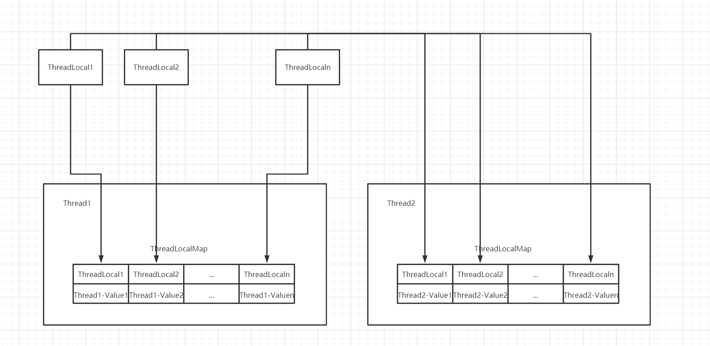

# 小林家的ThreadLocal

## 一、什么是ThreadLocal

本文ThreadLocal基于jdk1.8

```ThreadLocal```提供了线程的局部变量。该变量与常规变量不同的是该变量为每个线程自身独有，是其他线程无法访问的。实现了线程数据之间的隔离。我们可以通过```ThreadLocal```的```get```和```set```方法来存取所谓的线程局部变量。

## 二、ThreadLocal原理

变量的线程私有是通过```ThreadLocal```和```Thread```中维护的```ThreadLocalMap```共同实现的。



每一个线程之中维护了一个```ThreadLocalMap```，```ThreadLocal```将自身作为key，将值存入Map中。当线程需要取值时，再利用```ThreadLocal```对象在当前线程的```ThreadLocalMap```中将值取出来。

下面是get和set方法的源码

```java
	/**
     * Returns the value in the current thread's copy of this
     * thread-local variable.  If the variable has no value for the
     * current thread, it is first initialized to the value returned
     * by an invocation of the {@link #initialValue} method.
     *
     * @return the current thread's value of this thread-local
     */
    public T get() {
        Thread t = Thread.currentThread();
        //获取当前线程的ThreadLocalMap
        ThreadLocalMap map = getMap(t);
        if (map != null) {
            ThreadLocalMap.Entry e = map.getEntry(this);
            if (e != null) {
                @SuppressWarnings("unchecked")
                T result = (T)e.value;
                return result;
            }
        }
        //将默认值set进去并返回默认值
        return setInitialValue();
    }
```


```java
	/**
     * Sets the current thread's copy of this thread-local variable
     * to the specified value.  Most subclasses will have no need to
     * override this method, relying solely on the {@link #initialValue}
     * method to set the values of thread-locals.
     *
     * @param value the value to be stored in the current thread's copy of
     *        this thread-local.
     */
    public void set(T value) {
        Thread t = Thread.currentThread();
        //获取当前线程的ThreadLocalMap
        ThreadLocalMap map = getMap(t);
        if (map != null)
            map.set(this, value);
        else
            //新建map
            createMap(t, value);
    }

	void createMap(Thread t, T firstValue) {
        t.threadLocals = new ThreadLocalMap(this, firstValue);
    }
```

## 三、ThreadLocalMap

```ThreadLocalMap```构造方法

```java
    /**
     * Construct a new map initially containing (firstKey, firstValue).
     * ThreadLocalMaps are constructed lazily, so we only create
     * one when we have at least one entry to put in it.
     */
    ThreadLocalMap(ThreadLocal<?> firstKey, Object firstValue) {
        //新建Entry数组
        table = new Entry[INITIAL_CAPACITY];
        int i = firstKey.threadLocalHashCode & (INITIAL_CAPACITY - 1);
        table[i] = new Entry(firstKey, firstValue);
        size = 1;
        //设置阈值
        setThreshold(INITIAL_CAPACITY);
    }

    /**
     * Construct a new map including all Inheritable ThreadLocals
     * from given parent map. Called only by createInheritedMap.
     *
     * @param parentMap the map associated with parent thread.
     */
    private ThreadLocalMap(ThreadLocalMap parentMap) {
        Entry[] parentTable = parentMap.table;
        int len = parentTable.length;
        setThreshold(len);
        table = new Entry[len];

        for (int j = 0; j < len; j++) {
            Entry e = parentTable[j];
            if (e != null) {
                @SuppressWarnings("unchecked")
                ThreadLocal<Object> key = (ThreadLocal<Object>) e.get();
                if (key != null) {
                    Object value = key.childValue(e.value);
                    Entry c = new Entry(key, value);
                    int h = key.threadLocalHashCode & (len - 1);
                    while (table[h] != null)
                        h = nextIndex(h, len);
                    table[h] = c;
                    size++;
                }
            }
        }
    }
```

总的来说还是比较简单的，如果你对HashMap较为了解的话。ThreadLocalMap的初始容量为**16**，负载因子为**0.75**，每次扩容数组长度变为原来的**两倍**。值得注意的是，当出现冲突时，ThreadLocalMap使用的是**线性探测法**。

## 四、内存泄漏问题

ThreadLocalMap使用弱引用来避免ThreadLocal对象的内存泄漏问题。


图中虚线表示弱引用，实线表示强引用。

若ThreadLocal对象失去了引用，即无法再访问该对象时。若此时Entry的key为强引用即还存在强引用链，该ThreadLocal对象无法回收。现在为弱引用，则垃圾收集器将会对其进行回收。当ThreadLocal对象被回收时，Entry 的key被置为null。

多说几句：

> **弱引用**与**软引用**的区别在于：只具有**弱引用**的对象拥有**更短暂**的**生命周期**。在垃圾回收器线程扫描它所管辖的内存区域的过程中，一旦发现了只具有**弱引用**的对象，不管当前**内存空间足够与否**，都会**回收**它的内存。不过，由于垃圾回收器是一个**优先级很低的线程**，因此**不一定**会**很快**发现那些只具有**弱引用**的对象。

到这里，我们知道了使用弱引用解决ThreadLocal对象的内存泄漏问题。但是对于Entry对象，仍然存在强引用链，垃圾回收器仍无法对其进行垃圾回收。所以建议当变量使用完之后应该手动remove掉，避免内存泄漏。

但是，ThreadLocalMap对于该问题有一些补救措施。

1. ThreadLocalMap由Thread维护，生命周期同Thread对象保持一致。（这准确来说并不算补救措施，应该是Thread的特性）
2. ThreadLocalMap 的 set 方法中，通过 ```replaceStaleEntry``` 方法将所有键为 null 的 Entry 的值设置为 null，从而使得该值可被回收。另外，会在 rehash 方法中通过 ```expungeStaleEntry``` 方法将键和值为 null 的 Entry 设置为 null 从而使得该 Entry 可被回收。通过这种方式，ThreadLocal 可防止内存泄漏。

```java
    private void set(ThreadLocal<?> key, Object value) {
      Entry[] tab = table;
      int len = tab.length;
      int i = key.threadLocalHashCode & (len-1);

      for (Entry e = tab[i]; e != null; e = tab[i = nextIndex(i, len)]) {
        ThreadLocal<?> k = e.get();
        if (k == key) {
          e.value = value;
          return;
        }
        if (k == null) {
          replaceStaleEntry(key, value, i);
          return;
        }
      }
      tab[i] = new Entry(key, value);
      int sz = ++size;
      if (!cleanSomeSlots(i, sz) && sz >= threshold)
        rehash();
    }
```

但是！在线程池的使用场景中，若线程池的工作线程不被销毁则还是会出现内存泄漏问题，还是需要将使用完的ThreadLocal值进行remove。

****

参考文献：

[Java进阶（七）正确理解Thread Local的原理与适用场景](http://www.jasongj.com/java/threadlocal/)

[ThreadLocal就是这么简单](https://juejin.im/post/5ac2eb52518825555e5e06ee#heading-5)

[理解Java的强引用、软引用、弱引用和虚引用](https://juejin.im/post/5b82c02df265da436152f5ad)


****

下面是私货时间：

