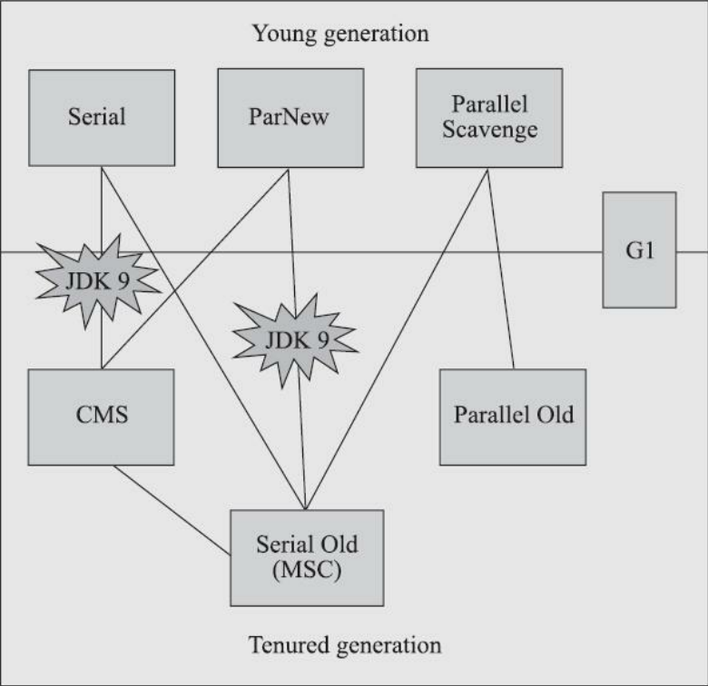
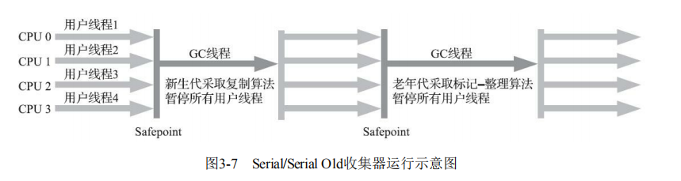
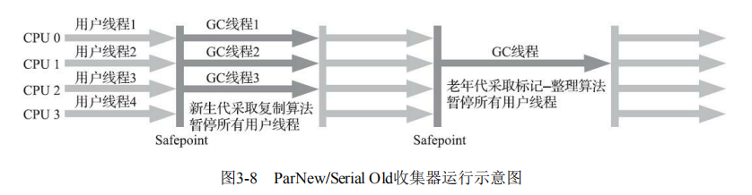
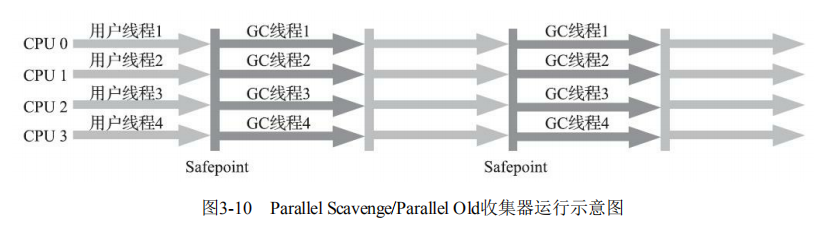
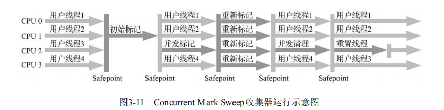
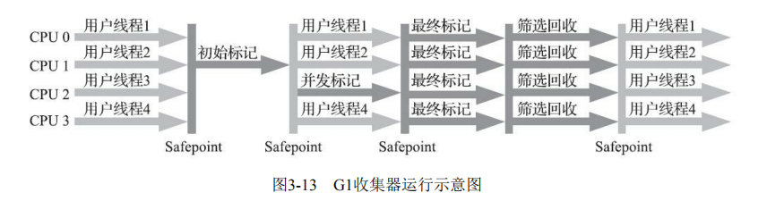
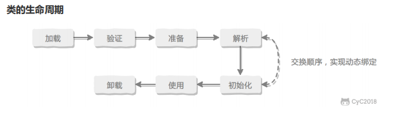

## JVM整理

**JDK 1.8 之前：**

**JDK 1.8 ：**

线程私有：程序计数器、虚拟机栈、本地方法栈

线程共享：堆、方法区、直接内存

### 程序计数器

字节码解释器通过改变程序计数器去依次读取指令，实现代码流程的控制。

程序计数器是用来记录线程运行位置的，当发生线程切换时能够通过程序计数器保存线程的运行位置。

### 虚拟机栈

虚拟机栈存储了栈帧，每一次调用一个方法的时候就会往虚拟机栈里面压入一个栈帧，当方法结束的时候，这个栈帧就会从虚拟机栈里弹出。栈帧存储了局部变量表，局部变量表存储了基本数据类型和对象引用

- **`StackOverFlowError`：** 栈深度溢出。
- **`OutOfMemoryError`：** 栈拓展失败。

如果线程请求的栈深度超过虚拟机所允许的深度抛StackOverflowError，如果虚拟机栈的容量是允许动态拓展的时候，当栈拓展时无法申请到足够的内存抛OutOfMemoryError，如果其他线程被创建的时候虚拟机栈申请不到足够空间的时候也会抛OutOfMemoryError

### 本地方法栈

虚拟机栈执行Java方法，本地方法栈执行的是Native方法，HotSpot将本地方法栈和虚拟机栈合并了。

在栈深度溢出时抛StackOverflowError，在栈拓展失败的时候抛OutOfMemoryError

### 堆

Java中，几乎所有的对象都在堆上分配，但有些对象经过逃逸分析发现没有发生逃逸的话就会直接在栈上分配。1.8之前，堆分为新生代、老年代、永久代。1.8的时候永久代被废除，取而代之的是元空间。

新生代还分为：伊甸园、from survivor、to survivor

1. **`OutOfMemoryError: GC Overhead Limit Exceeded`** ： 当JVM花太多时间执行垃圾回收并且只能回收很少的堆空间时，就会发生此错误。
2. **`java.lang.OutOfMemoryError: Java heap space`** :假如在创建新的对象时, 堆内存中的空间不足以存放新创建的对象, 就会引发`java.lang.OutOfMemoryError: Java heap space` 错误。(和本机物理内存无关，和你配置的内存大小有关！)

### 方法区

方法区是Java虚拟机规范规定的，永久代是HotSpot对方法区的一个实现，方法区和永久代的关系好比接口和实现类。

方法区用于存储已被**虚拟机加载的类信息、常量、静态变量**等数据。

当方法区无法满足新的内存分配需求的时候抛OutOfMemoryError

为什么使用元空间代替永久代？

1.永久代有一个jvm本身设置的大小上限，无法进行调整。元空间使用的是直接内存吗，受本机可用内存限制，虽然元空间还是有内存溢出的风险，但比原来出现的机率要小很多。当你元空间溢出时会得到如下错误： `java.lang.OutOfMemoryError: MetaSpace`

2.因为元空间可以做到只受系统内存大小的限制，所以能加载的类就更多了。

运行时常量池

运行时常量池是方法区的一部分，用来存放编译期生成的各种字面量和符号引用，这部分数据会在类加载后存放到方法区的运行时常量池里。

1. **JDK1.7之前运行时常量池逻辑包含字符串常量池存放在方法区, 此时hotspot虚拟机对方法区的实现为永久代**
2. **JDK1.7 字符串常量池被从方法区拿到了堆中, 这里没有提到运行时常量池,也就是说字符串常量池被单独拿到堆,运行时常量池剩下的东西还在方法区, 也就是hotspot中的永久代** 。
3. **JDK1.8 hotspot移除了永久代用元空间(Metaspace)取而代之, 这时候字符串常量池还在堆, 运行时常量池还在方法区, 只不过方法区的实现从永久代变成了元空间(Metaspace)**

### 直接内存

JDK1.4 中新加入的 **NIO(New Input/Output) 类**，引入了一种基于**通道（Channel）** 与**缓存区（Buffer）** 的 I/O 方式，它可以直接使用 Native 函数库直接分配堆外内存，然后通过一个存储在 Java 堆中的 DirectByteBuffer 对象作为这块内存的引用进行操作。这样就能在一些场景中显著提高性能，因为**避免了在 Java 堆和 Native 堆之间来回复制数据**。

本机直接内存的分配不会受到 Java 堆的限制，但是，既然是内存就会受到本机总内存大小以及处理器寻址空间的限制。

各内存区域oom：

1.堆：对象不断创建且gcroot可达

2.虚拟机栈 & 本地方法栈：线程太多导致新建线程无法申请到虚拟机栈空间或栈空间拓展失败

3.方法区（元空间）：代理类不断创建

>元空间gc的条件
>
>* 该类所有的实例都已经被回收；
>
>* 加载该类的ClassLoader已经被回收；
>
>* 该类对应的java.lang.Class对象没有任何地方被引用。

4.直接内存：使用NIO等直接使用直接内存（现象:堆快照小，且有使用直接内存）

对象的创建

1.类加载检查

当虚拟机遇到一个new指令的时候，他会去检查这个指令的参数能不能在常量池中定位到一个类的符号引用，然后检查这个类有没有被加载、解析、初始化过。如果没有的话就需要先执行类的加载过程。

2.分配内存

在类加载检查通过后，虚拟机为新生的对象分配内存。（对象所需要的内存大小在类加载完成之后就能确定了）

分配内存的两种方式：

* 内存是规整的：指针碰撞

将已经分配的内存放在一边，将还没分配的内存放在一边，中间拿一个指针分隔。

* 内存不是规整的：空闲列表

维护一个列表，分配内存时查表分配。

>  内存分配的并发问题
>
> 1.cas失败重试。
>
> 2.TLAB，虚拟机为每一个线程预先分配出一块内存，叫做TLAB，分配内存的时候现在TLAB分配，在TLAB内存用完之后使用cas分配。

3.初始化零值

在内存分配完之后需要将内存空间都初始化零值，这一步保证了Java的类实例中，成员变量不用赋初始值就能使用。

4.设置对象头

记录对象的类的元数据信息，对象的GC分代年龄...

5.执行init方法

我就直接理解成执行构造方法。

对象的内存布局

3部分：对象头、实例数据、对其填充

对象头：

对象头包括两部分：1.存储对象自身运行时的数据（hashCode，分代年龄，锁标志...）

2.类型指针，指向这个对象的类的元数据的指针，虚拟机通过这个指针来确定这个对象属于哪个类。

实例数据：

存储程序中设置的对象成员变量的值。

对其填充：

保证对象必须是8个字节的整数倍。

对象的访问定位：

1.引用存储的是句柄，使用句柄的话需要在内存划出一部分空间作为句柄池，引用存储的是对象句柄的地址，句柄包含了对象对象的地址。

2.直接使用指针访问，引用直接访问堆中的对象。

使用句柄的好处：引用中存储了稳定的句柄指针，对象移动时只需要改变句柄的实例对象指针，引用不用修改。

使用直接指针的好处：少了一步指针定位的开销。

GC

1.部分收集

Minor GC/Young GC：只对新生代进行收集

当伊甸园满了触发gc，伊甸园和from survivor存活的对象都会被复制，放到to survivor里面。

当对象年龄到达15时晋升到老年代，当survivor区已经被占用了50%，那么年龄最高的对象也会晋升老年代。

解决跨代引用问题：

使用卡表，老年代中如果一个对象引用了年轻代对象的话，就把这个老年代的对象记录起来，然后设置为脏卡，当发生Young GC的时候会扫描脏卡，把这些节点也作为GC root。当完成脏卡的扫描之后会将脏卡置零。卡表空间换时间，避免对整个老年代的扫描。

Major GC/Old GC：只对老年代进行垃圾收集，Major GC在一些语境下也表示Full GC（只有CMS并发收集是这个模式）

Mixed GC：混合GC（只有G1是这个模式）

2.整堆收集（Full GC）

收集整个Java堆和方法区

当准备要触发一次young GC时，如果发现统计数据说之前young GC的平均晋升大小比目前old gen剩余的空间大，则不会触发young GC而是转为触发full GC（因为HotSpot VM的GC里，除了CMS的concurrent collection之外，其它能收集old gen的GC都会同时收集整个GC堆，包括young gen，所以不需要事先触发一次单独的young GC）；或者，如果有perm gen的话，要在perm gen分配空间但已经没有足够空间时，也要触发一次full GC；或者System.gc()、heap dump带GC，默认也是触发full GC。Parallel Scavenge（-XX:+UseParallelGC）框架下，默认是在要触发full GC前先执行一次young GC，并且两次GC之间能让应用程序稍微运行一小下，以期降低full GC的暂停时间（因为young GC会尽量清理了young gen的死对象，减少了full GC的工作量）。控制这个行为的VM参数是-XX:+ScavengeBeforeFullGC。

判断对象是否死亡

1.引用计数法：每当有一个地方引用这个对象的时候，引用计数器加1，引用失效，引用计数器减1。难解决对象之间循环引用的问题。

2.可达性分析：以GC root对象为起点向下扫描，扫描过的路径叫做引用链，当一个对象没有和任何的GC root的引用链相连的话就证明这个对象不可达，可以进行回收。

三色标记

白，灰，黑

解决并发标记问题（造成对象“消失”）：

赋值器插入了一条或者多条黑色对象到白色对象的引用【1】，然后删除了全部灰色对象对该白色对象的直接或者间接引用【2】。

1.增量更新，破坏【1】条件，当黑色对象插入指向白色对象的引用关系时，将这个引用记录下来，等并发扫描结束之后，再将这些记录的黑色对象为根，再扫描一遍。

2.原始快照，破坏【2】条件，当灰色对象将要删除对白色对象的引用的时候，将这次删除记录下来，等并发标记结束之后，以记录的灰色对象为根，再扫描一遍。

可作为GC root 的对象：

1.虚拟机栈（栈帧中的本地变量表）中引用的对象

2.本地方法栈（Native方法）中引用的对象

3.方法区中类的静态属性引用的变量

4.方法区中常量引用的变量：

方法区包含常量池，字符串常量池包含字符串对象作为gc root（常量池为方法区的东西，只不过把方法区拆分到堆和元空间两部分实现而已，不要混淆）

判断常量是否被废弃

该常量没有被任何对象引用

判断类是否无用

1.堆中不存在该类及其派生子类的实例

2.加载该类的classloader已经被回收

3.该类对应的class对象没有被引用

垃圾回收算法：

1.标记清除

2.标记复制

3.标记整理

4.分代收集：

把堆分成新生代和老年代，这样的话就能根据各个年代的特点去选择合适的垃圾回收算法。

在新生代中，每次收集都会有大量对象死去，那么就使用标记复制算法。

在老年代中，对象的成活率是比较高的，所以使用标记清除或者标记整理算法会好一些。

垃圾回收器

Parallel Scavenge收集器基于标记复制实现，Parallel Scavenge收集器的特点是它的关注点与其他收集器不同，CMS等收集器的关注点是尽可能地缩短垃圾收集时用户线程的停顿时间，而Parallel Scavenge收集器的目标则是达到一个可控制的吞吐量。（吞吐量：cpu中用于运行用户代码的时间与cpu的总消耗时间的比值）JDK1.8默认使用的是Parallel Scavenge + Parallel Old

年轻代：复制算法

老年代：标记整理算法

CMS（标记清除算法）Concurrent Mark Sweep

是一种以获取最短停顿时间为目标的垃圾回收器，第一款真正意义上的并发收集器，他第一次实现了让垃圾收集线程和用户线程同时工作。

工作流程

1.初始标记

stop the world，标记所有和gc root相连的对象，速度很快。

2.并发标记

并发标记的线程和用户线程一起运行，去遍历整个对象图，这个过程耗时比较长，但他并不需要停顿用户线程，可以并发执行。

3.重新标记

为了修正在并发标记期间因为和用户线程并发运行导致一些对象引用被用户线程修改，然后导致的对象标记改变的问题。（会比初始标记的时间稍长，但时间远远少于并发标记的时间）

4.并发清除

清除判断已经死亡的对象，这个阶段也可以和用户线程一起运行。

优点：并发收集，停顿时间短。

缺点：

1.对处理器资源敏感

如果本来应用的处理器负载就很高，使用CMS的话还需要分出一部分线程作为垃圾回收就可能导致用户程序的执行速度忽然大幅降低。

2.无法处理浮动垃圾

在并发标记和并发清除阶段和用户线程并发运行，这两个阶段用户线程产生的垃圾称为浮动垃圾，这部分垃圾只能等到下一次才能回收。所以CMS垃圾回收需要给用户线程预留一定的空间存放这些浮动垃圾。如果阈值设置太低的话，虽然能够预留足够空间去存储浮动垃圾，但垃圾回收程序会被频繁的激活；如果设置的阈值比较大的话，可能预留的空间无法存储浮动垃圾就会出现并发失败，这时候虚拟机会冻结用户线程，使用Serial Old来重新进行垃圾回收，如果频繁地出现并发失败的话对性能的影响是很严重的。

3.碎片空间

标记清除算法容易产生大量的碎片空间，导致大对象无法分配

G1

G1针对的是多核处理器和大容量的机器，实现可预期可配置的Stop The World停顿时间。

G1把内存空间划分为一个个Region，每一个区域可能是伊甸园，Survivor，或者老年代，同一个时刻只能是一种状态。G1还有为大对象分配的Humongous区域，一个或者多个Humongous可以分配大对象。

G1的特点：

1.分成一个个Region，不用回收整个年轻代或者老年代，还建立了可预测的时间模型，去回收价值最大的Region，实现可预测的停顿时间，保证了G1在有限的时间内尽可能高的收集效率。

2.使用标记复制算法，不会产生内存碎片。

解决跨Region引用：使用卡表和记忆集，卡表是记录了我指向谁，记忆集记录了谁指向我。

使用记忆集的原因是因为不能像跨代引用那样直接扫描老年代的卡表就行，因为Region非常多，不能扫描全部Region的卡表。

1.初始标记

标记一下与GC root 直接关联的对象，需要Stop The World，但时间很快。

2.并发标记

从GC root对堆中的对象进行可达性分析，与用户线程并发执行。

在并发标记阶段需要预留出一部分空间去存放新分配的对象，如果垃圾回收赶不上内存分配的话就会触发Full GC导致长时间停顿。使用原始快照去防止并发标记时出错。

3.最终标记

对并发标记产生的原始快照进行处理吗，需要Stop The World。

4.筛选回收

更新Region的统计数据，对各个Region的回收价值和成本进行排序，根据用户指定的期望时间指定回收计划，然后将对应的Region使用标记复制的方法复制到空的Region中。需要Stop The World，因为涉及对象的移动。

G1对比CMS

优点：

G1正对年轻代和老年代，CMS只能用于老年代。

G1可以指定期望的停顿时间，能回收价值最高的Region，保证回收效率。

G1宏观是一个标记整理算法，不会产生内存碎片。

缺点：

G1消耗的额外cpu资源更多，消耗的额外内存更多。

Young GC：

在伊甸园空间耗尽时触发，每次Young GC会选定所有新生代Region，同时计算下次的Young GC所需的伊甸园和Survivor空间，动态控制Region的数量来控制Young GC

Mixed GC：

当老年代到达阈值的时候触发Mixed GC，选定所有年轻代Region，根据全局并发标记阶段得到的价值最高的老年代Region，然后依照用户指定的期望时间，选择价值较高的老年代Region进行回收。

由于G1收集器自身已经有一套预测和调整机制了，因此我们首先的选择是相信它，即调整`-XX:MaxGCPauseMillis=N`参数，这也符合G1的目的——让GC调优尽量简单，这里有个取舍：如果减小这个参数的值，就意味着会调小新生代的大小，也会导致新生代GC发生得更频繁，同时，还会导致混合收集周期中回收的老年代分区减少，从而增加FULL GC的风险。这个时间设置得越短，应用的吞吐量也会受到影响。

G1导致的Full GC

1.并发标记阶段Full GC

预留的空间太小，将阈值降低，提前触发GC

2.Mixed GC过后Full GC

回收的空间太小，增加期望时间，让g1能回收更多的内存

3.转移失败（标记复制，复制的时候发现没有空间能复制了）

将阈值降低，增加空间回收的频率

4.大对象分配失败

将阈值降低，增加回收的频率去增加内存整理的频率，避免碎片化。堆转储文件？

类加载机制

1.加载

* 通过类的全类名获取这个类的二进制字节流
* 将这个字节流代表的静态存储结构转化成方法区运行时的数据结构
* 在内存中生成这个类的Class对象，作为方法区数据的访问入口

**一个非数组类的加载阶段（加载阶段获取类的二进制字节流的动作）是可控性最强的阶段，这一步我们可以自定义类加载器去控制字节流的获取方式（重写一个类加载器的 `loadClass()` 方法）。数组类型不通过类加载器创建，它由 Java 虚拟机直接创建。**

2.验证

确保Class文件的字节流中的信息符合当前虚拟机的要求，并且不能危害虚拟机自身的安全。

3.准备

为类变量分配内存并设置变量的赋初始值

1. 这时候进行内存分配的仅包括类变量（static）使用的是方法区的内存。
2. 这里所设置的初始值"通常情况"下是数据类型默认的零值（如0、0L、null、false等），比如我们定义了`public static int value=111` ，那么 value 变量在准备阶段的初始值就是 0 而不是111（初始化阶段才会赋值）。特殊情况：比如给 value 变量加上了 fianl 关键字`public static final int value=111` ，那么准备阶段 value 的值就被赋值为 111。

4.解析

将常量池中的符号引用转化为直接引用

5.初始化

执行类的初始化方法<clinit>，静态代码块和赋初始值在这个方法里执行，对于这个方法的调用，jvm会保证多线程环境中的安全性，这个方法自带锁的，但有的时候在并发环境下初始化类会造成死锁。

一个类的初始化方法只会被执行一次，只会被初始化一次。

> 虚拟机规范没有规定类需要在什么时候加载，但是对于初始化阶段，虚拟机严格规范了有且只有5种情况下，必须对类进行初始化(只有主动去使用类才会初始化类)：
>
> 1. 当遇到 new 、 getstatic、putstatic或invokestatic 这4条直接码指令时，比如 new 一个类，读取一个静态字段(未被 final 修饰)、或调用一个类的静态方法时。
>    - 当jvm执行new指令时会初始化类。即当程序创建一个类的实例对象。
>    - 当jvm执行getstatic指令时会初始化类。即程序访问类的静态变量(不是静态常量，常量会被加载到运行时常量池)。
>    - 当jvm执行putstatic指令时会初始化类。即程序给类的静态变量赋值。
>    - 当jvm执行invokestatic指令时会初始化类。即程序调用类的静态方法。
> 2. 使用 `java.lang.reflect` 包的方法对类进行反射调用时如Class.forname("..."),newInstance()等等。如果类没初始化，需要触发其初始化。
> 3. 初始化一个类，如果其父类还未初始化，则先触发该父类的初始化。
> 4. 当虚拟机启动时，用户需要定义一个要执行的主类 (包含 main 方法的那个类)，虚拟机会先初始化这个类。
> 5. MethodHandle和VarHandle可以看作是轻量级的反射调用机制，而要想使用这2个调用， 就必须先使用findStaticVarHandle来初始化要调用的类。
> 6. 当一个接口中定义了JDK8新加入的默认方法（被default关键字修饰的接口方法）时，如果有这个接口的实现类发生了初始化，那该接口要在其之前被初始化。

6.卸载

卸载类需要满足3个要求:

1. 该类的所有的实例对象都已被GC，也就是说堆不存在该类的实例对象。
2. 该类的Class对象没有在其他任何地方被引用
3. 该类的类加载器的实例已被GC

由jvm自带的类加载器加载的类是不会被卸载的。但是由我们自定义的类加载器加载的类是可能被卸载的。

jdk自带的BootstrapClassLoader,PlatformClassLoader,AppClassLoader负责加载jdk提供的类，所以它们(类加载器的实例)肯定不会被回收。而我们自定义的类加载器的实例是可以被回收的，所以使用我们自定义加载器加载的类是可以被卸载掉的。