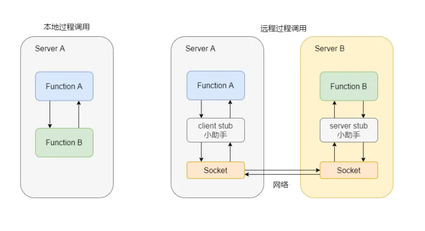
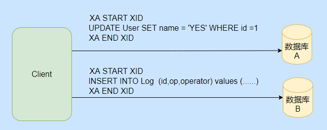
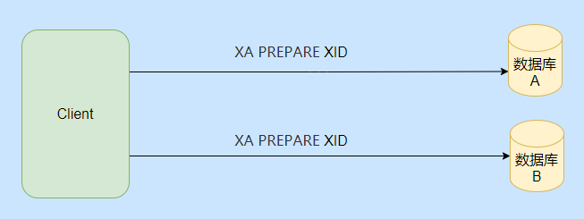
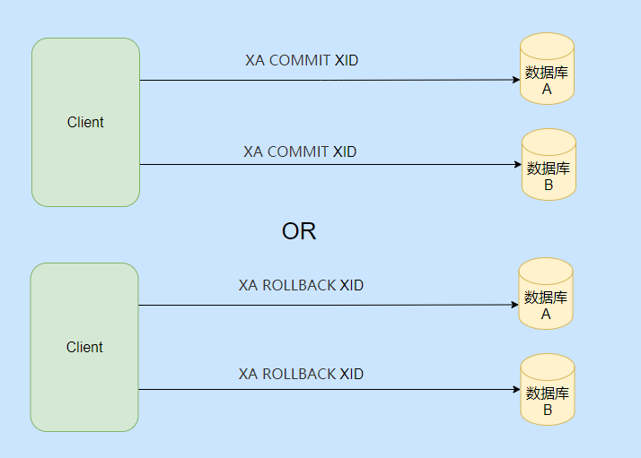

# 分布式

## CAP 理论

- C : Consistency 一致性,数据在多个副本之间似否能够保持一致的特性。

- A : Availability 可用性，系统服务必须一直处于可用状态，对每个请求总是在指定的时间返回结果。

- P : Partition tolerance 分区容错性,遇到分区网络故障时，仍能对外提供一致性和可用性的服务。（网络通信可能失败，对于分布式系统而言，网络故障可以说肯定会发生，那么P是一定成立的）

只能满足PC或者PA

## Base 理论

Basically Available(基本可用)、Soft state(软状态) 和 Eventuanlly consistent （最终一致性）3个短语的简写。来实现高可用，可拓展的大型分布式系统。

- 基本可用：系统出现不可预知的故障时，允许损失部分可用性。

  ​	**响应时间上的损失**：正常情况下的搜索引擎0.5秒即返回给用户结果，而基本可用的搜索引擎可以在2秒作用返回结果。

  ​	**功能上的损失**：在一个电商网站上，正常情况下，用户可以顺利完成每一笔订单。但是到了大促期间，为了保护购物系统的稳定性，部分消费者可能会被引导到一个降级页面。

- 弱（软）状态：数据的中间状态，并认为改状态存在不会一项系统整体可用性，允许不同节点数据副本数据同步过程中的延时。

  ​	软状态指的是：允许系统中的数据存在中间状态，并认为该状态不影响系统的整体可用性，即允许系统在多个不同节点的数据副本存在数据延时。

- 最终一致性：系统中所有数据副本，在一段时间的同步后，最终数据能够到一致性的状态。

  ​	上面说软状态，然后不可能一直是软状态，必须有个时间期限。在期限过后，应当保证所有副本保持数据一致性，从而达到数据的最终一致性。这个时间期限取决于网络延时、系统负载、数据复制方案设计等等因素。

## RPC

### rpc原理

rpc，远程过程调用。本地的方法调用可以说是本地过程调用，远程过程调用就是你本地调用了远程机子上的某个方法。 RPC 对标的是本地过程调用，至于 RPC 要如何调用远程的方法可以走 HTTP、也可以是基于 TCP 自定义协议。

1. 服务消费方（client）调用以本地调用方式调用服务；
2. client stub接收到调用后负责将方法、参数等组装成能够进行网络传输的消息体；
3. client stub找到服务地址，并将消息发送到服务端；
4. server stub收到消息后进行解码；
5. server stub根据解码结果调用本地的服务；
6. 本地服务执行并将结果返回给server stub；
7. server stub将返回结果打包成消息并发送至消费方；
8. client stub接收到消息，并进行解码；
9. 服务消费方得到最终结果。

dubbo就是一个rpc框架，能帮助我们屏蔽rpc的底层实现细节，在rpc的基础上，dubbo还拓展出很多功能，比如说超时重试，负载均衡，服务的自动注册和发现，服务调用链路生成...

### rpc和http的区别

**RPC 和 HTTP 就不是一个层级的东西，所以严格意义上这两个没有可比性，也不应该来作比较**。

HTTP 只是传输协议，协议只是规范了一定的交流格式，而且 RPC 是早于 HTTP 的，所以真要问也是问有 RPC 为什么还要 HTTP。

RPC 对比的是本地过程调用，是用来作为分布式系统之间的通信，它可以用 HTTP 来传输，也可以基于 TCP 自定义协议传输。

所以你要**先提出这两个不是一个层级的东西，没有可比性**，然后再表现一下，可以说 HTTP 协议比较冗余，所以 RPC 大多都是基于 TCP 自定义协议，定制化的才是最适合自己的。

当然也有基于 HTTP 协议的 RPC 框架，毕竟 HTTP 是公开的协议，比较通用，像 HTTP2 已经做了相应的压缩了，而且系统之间的调用都在内网，所以说影响也不会很大。

## 分布式

### 什么是分布式

说简单的分布式就是我们把整个系统拆分成不同的服务然后将这些服务放在不同的服务器上减轻单体服务的压力提高并发量和性能。比如电商系统可以简单地拆分成订单系统、商品系统、登录系统等等，拆分之后的每个服务可以部署在不同的机器上，如果某一个服务的访问量比较大的话也可以将这个服务同时部署在多台机器上。

### 为什么要分布式

1. 分布式系统根据业务进行拆分，每个团队可以负责一个服务的开发，提高开发效率。
2. 每个服务能够单独的部署，单独的升级和拓展。
3. 服务拆分之后，如果某一个业务模块流量很大，我们可以把这个服务部署到更多的机器上，能更有效的提高系统性能。

### 分布式的缺点

1. 引入新的痛点，分布式事务，需要去进行服务的注册和发现。
2. 运维困难，分布式是网状的，每个服务之间相互调用，会使得维护管理困难。

## Dubbo

### dubbo的总体架构

| 节点      | 角色说明                     |
| :-------- | :--------------------------- |
| Consumer  | 需要调用远程服务的服务消费方 |
| Registry  | 注册中心                     |
| Provider  | 服务提供方                   |
| Container | 服务运行的容器               |
| Monitor   | 监控中心                     |

1. 服务容器负责启动，加载，运行服务提供者。
2. 服务提供者在启动时，向注册中心注册自己提供的服务。
3. 服务消费者在启动时，向注册中心订阅自己所需的服务。
4. 注册中心返回服务提供者地址列表给消费者，如果有变更，注册中心将基于长连接推送变更数据给消费者。
5. 服务消费者，从提供者地址列表中，基于软负载均衡算法，选一台提供者进行调用，如果调用失败，再选另一台调用。
6. 服务消费者和提供者，在内存中累计调用次数和调用时间，定时每分钟发送一次统计数据到监控中心。

**重要知识点总结：**

- **注册中心负责服务地址的注册与查找，相当于目录服务，服务提供者和消费者只在启动时与注册中心交互，注册中心不转发请求，压力较小**
- **监控中心负责统计各服务调用次数，调用时间等，统计先在内存汇总后每分钟一次发送到监控中心服务器，并以报表展示**
- **注册中心，服务提供者，服务消费者三者之间均为长连接，监控中心除外**
- **注册中心通过长连接感知服务提供者的存在，服务提供者宕机，注册中心将立即推送事件通知消费者**
- **注册中心和监控中心全部宕机，不影响已运行的提供者和消费者，消费者在本地缓存了提供者列表**
- **注册中心和监控中心都是可选的，服务消费者可以直连服务提供者**
- **服务提供者无状态，任意一台宕掉后，不影响使用**
- **服务提供者全部宕掉后，服务消费者应用将无法使用，并无限次重连等待服务提供者恢复**

### dubbo负载均衡

1.默认，基于权重随机负载均衡

2.基于权重轮询

- 存在慢的提供者累积请求的问题，比如：第二台机器很慢，但没挂，当请求调到第二台时就卡在那，久而久之，所有请求都卡在调到第二台上。

3.最少活跃调用数

- **最少活跃调用数**，相同活跃数的随机，活跃数指调用前后计数差。
- 使慢的提供者收到更少请求，因为越慢的提供者的调用前后计数差会越大。

4.一致性hash

## 分布式事务

### 2PC

两阶段提交，（准备，提交/回滚）

使用一个事务协调者的角色来管理各个事务参与者。当需要开启一个分布式事务的时候，事务协调者向每个事务参与者发起准备命令，这时候每个事务参与者就会去开启一个自己的本地事务，准备阶段可以理解为出了事务提交，什么事情都做了，当事务参与者自己的准备阶段成功之后，会向事务协调者发送成功消息，如果每个事务参与者返回成功，那么协调者就会发送提交命令，让每个参与者提交自己本地事务；如果其中一个参与者出现失败，那么事务协调者会发送回滚命令，让所有的参与者进行回滚，参与者返回给协调者一个ack。

优点：利用数据库自身功能进行本地事务的提交和回滚，提交和回滚由数据库完成，不侵入我们的代码。

缺点：同步阻塞，在执行准备操作的时候会锁住资源。单点故障，如果协调者挂了整个事务就执行不下去了，如果是在发送准备命令之前挂了还行，如果是发送了准备命令之后挂了，如果是热点数据的话就完了，就算有新的事务协调者顶上来，他也不知道准备阶段之后是需要提交还是要回滚。数据不一致，在提交阶段，如果有些参与者由于网络故障或者一些原因，收不到提交命令的话就会导致其他参与者都提交了，然后他没提交，会出现数据不一致。（协调者这时候没收到ack的，向这个参与者重试提交命令就行了）

MySQL的XA是对2PC的落地实现，

简单的说就是要先定义一个全局唯一的 XID，然后告知每个事务分支要进行的操作。

可以看到图中执行了两个操作，分别是改名字和插入日志，等于先注册下要做的事情，通过 XA START XID 和 XA END XID 来包裹要执行的 SQL。

然后需要发送准备命令，来执行第一阶段，也就是除了事务的提交啥都干了的阶段。

然后根据准备的情况来选择执行提交事务命令还是回滚事务命令。

基本上就是这么个流程，不过 MySQL XA 的性能不高这点是需要注意的。

### 3PC

三阶段提交对于二阶段提交多了一步询问阶段。在执行事务之前，先询问事务参与者是否正常，如果参与者都正常再执行准备，提交/回滚操作。这一步是为了防止有的事务参与者不能正常执行，而其他参与者已经准备了，造成资源的锁定。但没有解决两阶段出现的问题。

### TCC

**TCC 是一种业务层面或者是应用层的两阶段提交**。

TCC 分为指代 Try、Confirm、Cancel ，也就是业务层面需要写对应的三个方法，主要用于跨数据库、跨服务的业务操作的数据一致性问题。

TCC 分为两个阶段，第一阶段是资源检查预留阶段即 Try，第二阶段是提交或回滚，如果是提交的话就是执行真正的业务操作，如果是回滚则是执行预留资源的取消，恢复初始状态。

虽说对业务有侵入，但是 TCC 没有资源的阻塞，每一个方法都是直接提交事务的，如果出错是通过业务层面的 Cancel 来进行补偿，所以也称补偿性事务方法。

这里有人说那要是所有人 Try 都成功了，都执行 Comfirm 了，但是个别 Confirm 失败了怎么办？

这时候只能是不停地重试调失败了的 Confirm 直到成功为止，如果真的不行只能记录下来，到时候人工介入了。

注意点：

**幂等问题**，因为网络调用无法保证请求一定能到达，所以都会有重调机制，因此对于 Try、Confirm、Cancel 三个方法都需要幂等实现，避免重复执行产生错误。

**空回滚问题**，指的是 Try 方法由于网络问题没收到超时了，此时事务管理器就会发出 Cancel 命令，那么需要支持 Cancel  在未执行 Try 的情况下能正常的 Cancel。

**悬挂问题**，这个问题也是指 Try 方法由于网络阻塞超时触发了事务管理器发出了 Cancel 命令，**但是执行了 Cancel 命令之后 Try 请求到了，你说气不气**。这都 Cancel 了你来个 Try，对于事务管理器来说这时候事务已经是结束了的，这冻结操作就被“悬挂”了，所以空回滚之后还得记录一下，防止 Try 的再调用。

**TCC 是通过业务代码来实现事务的提交和回滚，对业务的侵入较大，它是业务层面的两阶段提交，**。

它的性能比 2PC 要高，因为不会有资源的阻塞，并且适用范围也大于 2PC，在实现上要注意上面提到的几个注意点。

它是业界比较常用的分布式事务实现方式，而且从变体也可以得知，还是得**看业务变通的，不是说你要用 TCC 一定就得死板的让所有的服务都改造成那三个方法。**

### 本地消息表

本地消息就是利用了本地事务，会在数据库中存放一直本地事务消息表，在进行本地事务操作中加入了本地消息的插入，即**将业务的执行和将消息放入消息表中的操作放在同一个事务中提交**

这样本地事务执行成功的话，消息肯定也插入成功，然后再调用其他服务，如果调用成功就修改这条本地消息的状态。

如果失败也不要紧，会有一个后台线程扫描，发现这些状态的消息，会一直调用相应的服务，一般会设置重试的次数，如果一直不行则特殊记录，待人工介入处理。

可以看到还是很简单的，也是一种最大努力通知思想。

### 最终一致性（事务消息）

事务消息就是今天文章的主角了，它主要是适用于异步更新的场景，并且对数据实时性要求不高的地方。

它的目的是为了解决消息生产者与消息消费者的数据一致性问题。

比如你点外卖，我们先选了炸鸡加入购物车，又选了瓶可乐，然后下单，付完款这个流程就结束了。

而购物车里面的数据就很适合用消息通知异步删除，因为一般而言我们下完单不会再去点开这个店家的菜单，而且就算点开了购物车里还有这些菜品也没有关系，影响不大。

我们希望的就是下单成功之后购物车的菜品最终会被删除，所以要点就是下单和发消息这两个步骤要么都成功要么都失败。

### Seata AT

两阶段提交协议的演变：

- 一阶段：业务数据和回滚日志记录在同一个本地事务中提交，释放本地锁和连接资源。
- 二阶段：
  - 提交异步化，非常快速地完成。
  - 回滚通过一阶段的回滚日志进行反向补偿。

写隔离

- 一阶段本地事务提交前，需要确保先拿到 **全局锁** 。
- 拿不到 **全局锁** ，不能提交本地事务。
- 拿 **全局锁** 的尝试被限制在一定范围内，超出范围将放弃，并回滚本地事务，释放本地锁。

读隔离

​	在数据库本地事务隔离级别 **读已提交（Read Committed）** 或以上的基础上，Seata（AT 模式）的默认全局隔	离级别是 **读未提交（Read Uncommitted）** 。

​	如果应用在特定场景下，必需要求全局的 **读已提交** ，目前 Seata 的方式是通过 SELECT FOR UPDATE 语句的	代理，SELECT FOR UPDATE 会获取全局锁。

AT 的一阶段直接就把事务提交了，直接释放了本地锁，这么草率直接提交的嘛？当然不是，这里和本地消息表有点类似，就是利用本地事务，执行真正的事务操作中还会插入回滚日志，然后在一个事务中提交。

**这回滚日志怎么来的**？

通过框架代理 JDBC 的一些类，在执行 SQL 的时候解析 SQL 得到执行前的数据镜像，然后执行 SQL ，再得到执行后的数据镜像，然后把这些数据组装成回滚日志。

再伴随的这个本地事务的提交把回滚日志也插入到数据库的 UNDO_LOG 表中(所以数据库需要有一张UNDO_LOG 表)。

这波操作下来在一阶段就可以没有后顾之忧的提交事务了。

然后一阶段如果成功，那么二阶段可以异步的删除那些回滚日志，如果一阶段失败那么可以通过回滚日志来反向补偿恢复。

这时候有细心的同学想到了，万一中间有人改了这条数据怎么办？你这镜像就不对了啊？

所以说还有个全局锁的概念，**在本地事务提交前需要拿到全局锁**（此时还在事务中，也就是说对应修改的数据行还是被本地锁锁住的，其他事务无法修改），然后才能顺利提交本地事务。

如果一直拿不到那就需要回滚本地事务，释放本地锁。

