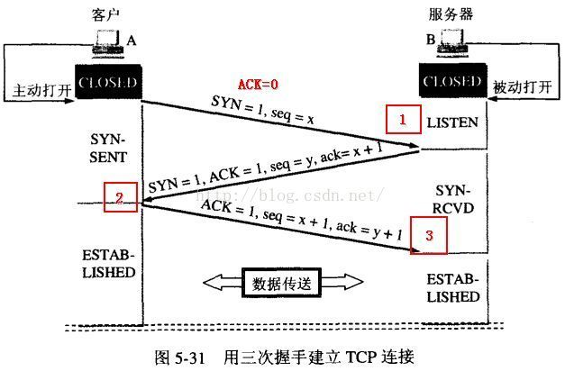
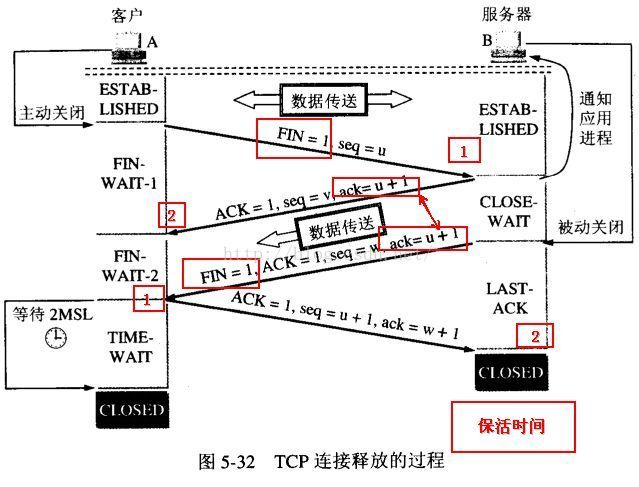

分层

**1. 物理层(physical layer)的作用是实现相邻计算机节点之间比特流的透明传送，尽可能屏蔽掉具体传输介质和物理设备的差异**

**2. 数据链路层(data link layer)通常简称为链路层。两台主机之间的数据传输，总是在一段一段的链路上传送的，这就需要使用专门的链路层的协议。** 在两个相邻节点之间传送数据时，**数据链路层将网络层交下来的 IP 数据报组装成帧**，在两个相邻节点间的链路上传送帧。每一帧包括数据和必要的控制信息（如同步信息，地址信息，差错控制等）

**3. 在计算机网络中进行通信的两个计算机之间可能会经过很多个数据链路，也可能还要经过很多通信子网。网络层的任务就是选择合适的网间路由和交换结点， 确保数据及时传送。** 在发送数据时，网络层把运输层产生的报文段或用户数据报封装成分组和包进行传送。在 TCP/IP 体系结构中，由于网络层使用 **IP 协议**，因此分组也叫 **IP 数据报** ，简称 **数据报**。

**4. 运输层(transport layer)的主要任务就是负责向两台主机进程之间的通信提供通用的数据传输服务**。应用进程利用该服务传送应用层报文。“通用的”是指并不针对某一个特定的网络应用，而是多种应用可以使用同一个运输层服务。由于一台主机可同时运行多个线程，因此运输层有复用和分用的功能。所谓复用就是指多个应用层进程可同时使用下面运输层的服务，分用和复用相反，是运输层把收到的信息分别交付上面应用层中的相应进程。

**运输层主要使用以下两种协议:**

1. **传输控制协议 TCP**（Transmission Control Protocol）--提供**面向连接**的，**可靠的**数据传输服务。
2. **用户数据协议 UDP**（User Datagram Protocol）--提供**无连接**的，尽最大努力的数据传输服务（**不保证数据传输的可靠性**）。

**5. 应用层(application-layer）的任务是通过应用进程间的交互来完成特定网络应用。**应用层协议定义的是应用进程（进程：主机中正在运行的程序）间的通信和交互的规则。对于不同的网络应用需要不同的应用层协议。在互联网中应用层协议很多，如**域名系统DNS**，支持万维网应用的 **HTTP协议**，支持电子邮件的 **SMTP协议**等等。我们把应用层交互的数据单元称为报文。

****

TCP和UDP

udp的话是不可靠的数据报协议，不需要连接，会尽最大努力交付，面向报文，没有拥塞控制，首部开销小，支持一对一，一对多，多对多，多对一的交互通信。（udp提供差错检验，使用伪首部配合进行差错检验，检查源ip，目的ip，源端口，目的端口，用户数据报的数据部分）

面向报文，udp对于应用程序交下来的报文，既不合并也不拆分，加上自己的首部之后就交给ip层，接收到了之后去除首部之后，把数据原封不动地上交给应用层

tcp是面向连接的协议，提供可靠交付，能保证数据不丢失，不出错，不重复，按顺序；是全双工的，面向字节流；提供拥塞控制，流量控制，差错控制等功能。

虽然应用程序和tcp的交互是一个一个大小不等的数据块，但tcp把用户交下来的数据仅仅看成无状态的字节流，tcp不知道所传输的字节流的含义，不保证接收方收到的数据块和发送方发送的数据块具有对应的大小关系。

TCP三次握手

1. 客户端->服务端（SYN=1 && 客户端生成seq:x）客户端进入SYN-Sent状态
2. 服务端->客户端（ACK=1 && 确认号:x+1 && 服务端生成seq:y && SYN=1）服务端进入SYN-RCVD状态，客户端接收后进入ESTABLISHED
3. 客户端->服务端（ACK=1 && 确认号:y+1 && seq:x+1）服务端接收后进入ESTABLISHED

SYN消耗一个序列号，ACK不消耗序列号

为什么要三次握手？

1. 三次握手能保证客户端和服务端都知道自己和对方的接收和发送功能都是正常的，三次握手是一个最少的次数。
2. 第三次握手能保证服务端资源不会由于网络问题导致的浪费，为什么这么说？如果tcp只有两次握手的话，如果第一次客户端发起的SYN连接请求由于网络原因，还没到达服务端，这时候客户端触发超时重传，发了第二个SYN请求，服务端接收到SYN请求，进行第二次握手，建立连接，这时候我们第一次发的SYN请求到达，服务端再进行第二次握手，那么这时候服务端就以为又要建立连接了，但第二次握手客户端是不会理会的，造成服务端资源的浪费。如果是三次握手才建立连接的话，客户端没返回ACK的话连接就不建立。

第三次握手ACK包丢失怎么办？

服务端第一次收到客户端的SYN之后，就会处于SYN-RCVD状态，此时双方还没有完全建立连接，服务端会将这个连接放进一个半连接队列里面，如果服务端在发送完SYN-ACK包，没有收到客户端的ACK包的话，那么服务端就会进行重传，如果超过重传次数的话，系统就把这个连接从半连接队列里面删除，释放这个半连接。

SYN攻击

服务端的资源分配是第二次握手的时候分配的，攻击者可以伪造大量不存在的ip地址，然后向服务端不断的发送SYN数据包，服务端就会回复SYN-ACK，然后把这个半连接放进半连接队列里面，服务端需要不断重试直到这些半连接达到重试次数才会把这个半连接移出队列，所以如果有大量的这种半连接占用半连接队列占满的话，正常的连接请求会因为半连接队列已经满了被丢弃。

防范方法：

1. 增大半连接队列的大小
2. 减少服务端重试次数
3. SYN Cookies，先不分配资源，先回复SYN-ACK，等到客户端回复之后再分配资源建立连接

TCP四次挥手

1. 客户端->服务端（FIN=1 && seq=u）客户端由ESTABLISHED转化为FIN-WAIT-1  ps：u为此前客户端发送的最后一个字节的序号+1
2. 服务端->客户端（ACK=1 && seq=v && 确认号:u+1）服务端由ESTABLISHED转化为CLOSE-WAIT，客户端接收到之后由FIN-WAIT-1转化为FIN-WAIT-2，这时候服务端还能继续发送数据，客户端还能继续接收数据  ps：v为此前服务端发送的最后一个字节的序号+1
3. 服务端->客户端（FIN=1 && ACK=1 && seq=v+n && 确认号:u+1）服务端由CLOSE-WAIT转化为LAST-ACK，客户端接收之后由FIN-WAIT-2转化为TIME-WAIT  ps：v+n，如果半关闭状态没有发送数据的话，n为0
4. 客户端->服务端（ACK=1 && seq=u+1 &&  确认号:v+n+1） 客户端转化为TIME-WAIT阶段等待2MSL后关闭连接，服务端收到之后关闭连接。

为什么挥手需要四次？

在关闭连接的时候，客户端发起FIN请求，这时候服务端可能还有数据需要发送，所以先回一个ACK，等数据发送完了之后再回一个FIN+ACK，得把回应拆成两步，所以有四次。

为什么最后需要等待2MSL?

MSL是最大报文存活时间，超过这个时间的报文都会被丢弃。

1. 保证客户端发送的最后一个ACK能够到达服务端。因为最后一个ACK可能会丢失，服务端会触发超时重传，重传FIN+ACK，客户端在等待的这段时间能够回应服务端，如果客户端没等待就关闭连接了，就会造成无法回复服务端的FIN+ACK，会导致服务端没办法正常关闭。
2. 客户端需要保证在本次连接中的所有报文都消亡，保证下一个新的连接中不会出现旧连接中的旧报文。

